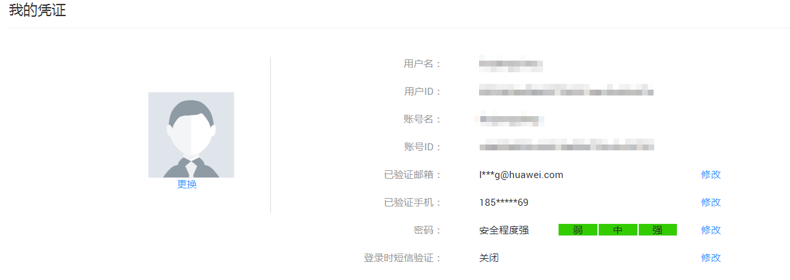

# 简介

欢迎使用消息通知服务提供的SDK，包含的语言有JAVA、Python、PHP、Go和C\#，通过在程序中集成SDK能简化您使用消息通知服务的复杂程度。其中，上述的语言中同时支持token和aksk方式的仅有JAVA，其他语言目前均只支持token方式进行认证。

通过使用前准备及代码示例向您展示如何使用SDK。

首先需了解示例代码的参数及如何获取参数值。

## 示例代码参数

<table><thead align="left"><tr id="row59223347"><th class="cellrowborder" valign="top" width="23.43%" id="mcps1.1.5.1.1">
参数名称

</th>
<th class="cellrowborder" valign="top" width="25.4%" id="mcps1.1.5.1.2">
参数介绍

</th>
<th class="cellrowborder" valign="top" width="36.88%" id="mcps1.1.5.1.3">
获取方法

</th>
<th class="cellrowborder" valign="top" width="14.29%" id="mcps1.1.5.1.4">
示例

</th>
</tr>
</thead>
<tbody><tr id="row50198296"><td class="cellrowborder" valign="top" width="23.43%" headers="mcps1.1.5.1.1 ">
YourAccountUserName

</td>
<td class="cellrowborder" valign="top" width="25.4%" headers="mcps1.1.5.1.2 ">
此参数为您的用户名

</td>
<td class="cellrowborder" valign="top" width="36.88%" headers="mcps1.1.5.1.3 "><ol id="ol48630964"><li>登录华为云。</li><li>单击右上角用户名下的“账号中心”，进入基本信息界面。</li><li>单击“管理我的凭证”，进入我的凭证界面。</li><li>查看“用户名”，即为YourAccountUserName。如<a href="#fig137531341175">图1</a>所示。</li></ol>
</td>
<td class="cellrowborder" valign="top" width="14.29%" headers="mcps1.1.5.1.4 ">
-

</td>
</tr>
<tr id="row9886408"><td class="cellrowborder" valign="top" width="23.43%" headers="mcps1.1.5.1.1 ">
YourAccountPassword

</td>
<td class="cellrowborder" valign="top" width="25.4%" headers="mcps1.1.5.1.2 ">
此参数为您登录华为云的密码

</td>
<td class="cellrowborder" valign="top" width="36.88%" headers="mcps1.1.5.1.3 ">
-

</td>
<td class="cellrowborder" valign="top" width="14.29%" headers="mcps1.1.5.1.4 ">
-

</td>
</tr>
<tr id="row44643603"><td class="cellrowborder" valign="top" width="23.43%" headers="mcps1.1.5.1.1 ">
YourAccountDomainName

</td>
<td class="cellrowborder" valign="top" width="25.4%" headers="mcps1.1.5.1.2 ">
此参数为您的账户名

</td>
<td class="cellrowborder" valign="top" width="36.88%" headers="mcps1.1.5.1.3 "><ol id="ol6238164735714"><li>登录华为云。</li><li>单击右上角用户名下的“账号中心”，进入基本信息界面。</li><li>单击“管理我的凭证”，进入我的凭证界面。</li><li>查看“账号名”，即为YourAccountDomainName。如<a href="#fig137531341175">图1</a>所示。</li></ol>
</td>
<td class="cellrowborder" valign="top" width="14.29%" headers="mcps1.1.5.1.4 ">
-

</td>
</tr>
<tr id="row12809933"><td class="cellrowborder" valign="top" width="23.43%" headers="mcps1.1.5.1.1 ">
YourRegionName

</td>
<td class="cellrowborder" valign="top" width="25.4%" headers="mcps1.1.5.1.2 ">
此参数代表您的所属区域

</td>
<td class="cellrowborder" valign="top" width="36.88%" headers="mcps1.1.5.1.3 ">
获取地址为：<a href="https://developer.huaweicloud.com/endpoint.html" target="_blank" rel="noopener noreferrer">地区和终端节点</a>。

 说明： 

RegionName为cn-north-1 、cn-south-1 或者cn-east-2 。

</td>
<td class="cellrowborder" valign="top" width="14.29%" headers="mcps1.1.5.1.4 ">
cn-north-1

</td>
</tr>
</tbody>
</table>

**图 1**  查看我的凭证  

