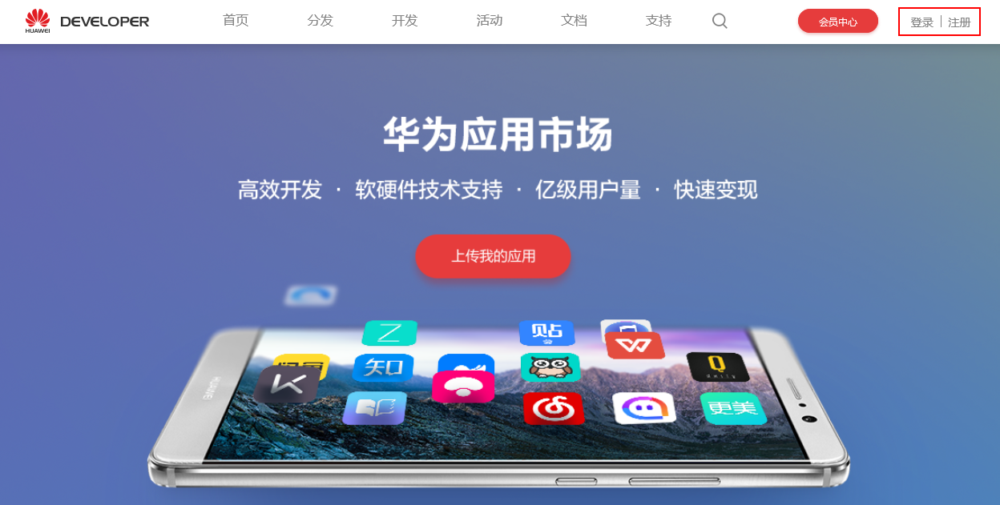
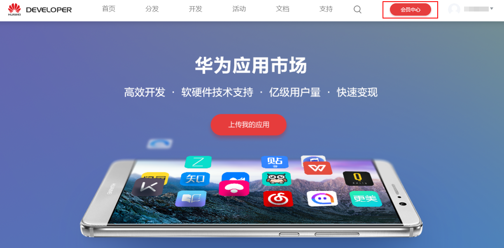
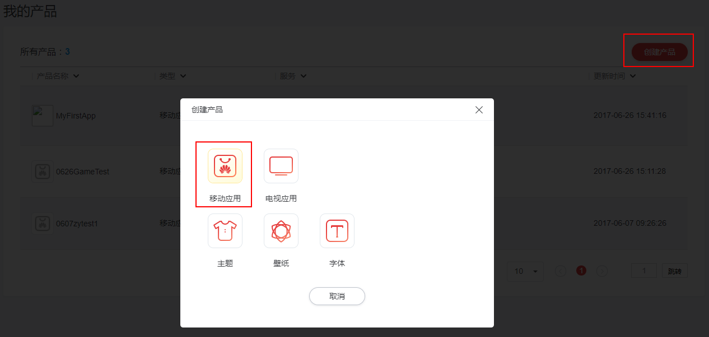
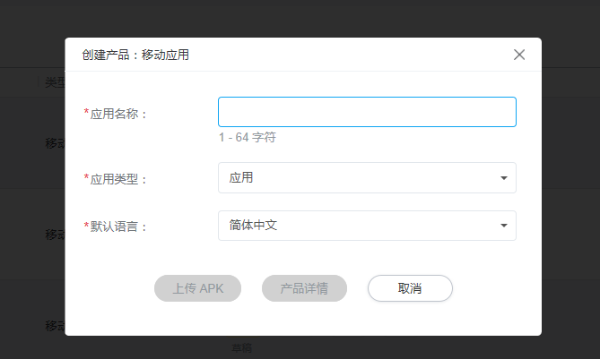
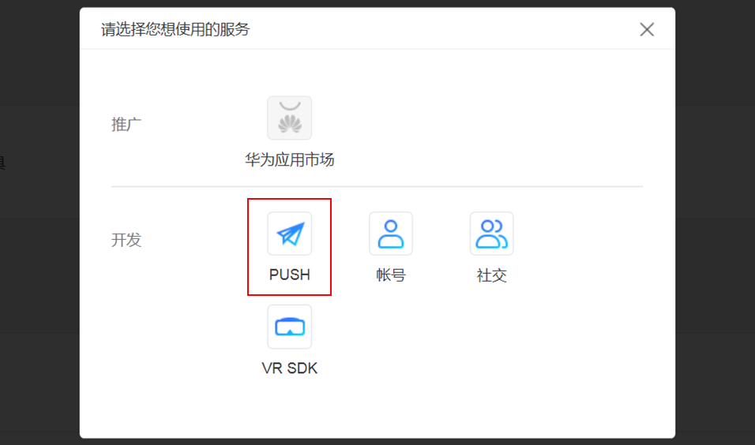
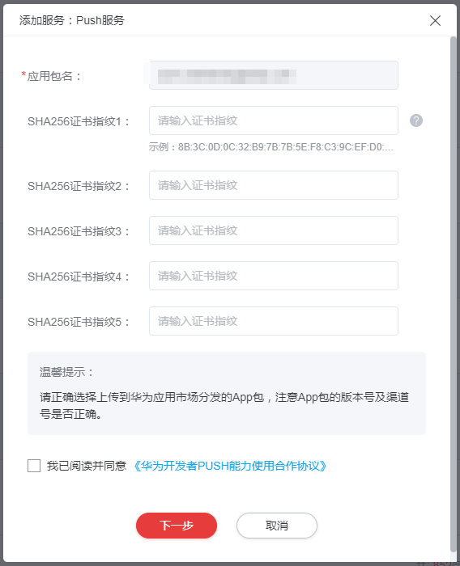
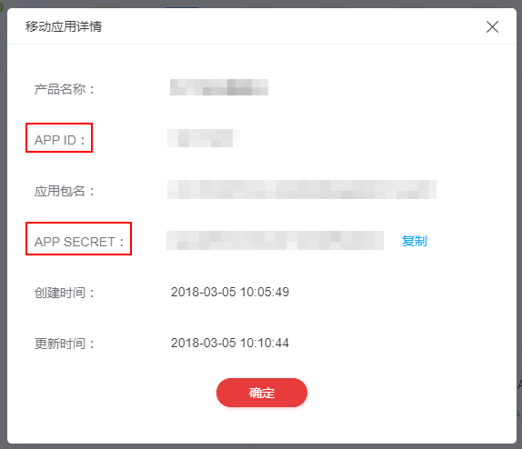

# HMS入门

HMS是为开发者提供的消息推送平台，建立了从云端到手机端的消息推送通道，使应用可以将最新信息及时通知用户。

本节介绍如何使用获取HMS的参数。

## 使用HMS的步骤

1.  注册为开发者。
    1.  访问[华为开发者联盟](https://developer.huawei.com/consumer/cn)。
    2.  单击注册，注册成为开发者。

        **图 1**  注册华为开发者联盟  
        

2.  创建应用。
    1.  登录[华为开发者联盟](https://developer.huawei.com/consumer/cn)。
    2.  单击“会员中心”，进入我的产品页面。

        **图 2**  进入会员中心  
        

    3.  单击“创建产品”，在“创建产品”页面选择“移动应用”，创建新的应用。

        **图 3**  创建移动应用  
        

    4.  填写移动应用的基本信息：应用名称、应用类型和默认语言。

        **图 4**  移动应用基本信息  
        

    5.  单击“上传APK”或者“产品详情”，完成产品创建。

3.  申请HMS PUSH服务。
    1.  选择创建的应用，进入产品详情页面，单击产品服务列表的“+”号。
    2.  在弹出页面，选择“PUSH”服务。

        **图 5**  选择PUSH服务  
        

        服务图标为灰色时，请将鼠标移到灰色的服务图标上，会有相关提示，请根据提示操作。

    3.  在配置信息界面填写应用包名。

        **图 6**  配置PUSH服务  
        

        > **说明：** 
        >应用包名必须和APK包名保持一致，且不可更改，请谨慎填写。

    4.  勾选“我已阅读并同意《华为开发者PUSH能力使用合作协议》”。
    5.  单击“下一步”，完成服务申请。

        开发者为APP开通PUSH服务后，华为方会分配服务参数，用于开发者集成HMS SDK时使用。

4.  获取PUSH服务参数。
    1.  登录[华为开发者联盟](https://developer.huawei.com/consumer/cn)。
    2.  选择“会员中心 \> 我的产品“，单击产品名称，进入指定的产品页面。
    3.  单击“移动应用详情“链接，在弹出的“移动服务详情”对话框获取服务参数。

        **图 7**  获取PUSN服务参数  
        

        PUSH服务参数的说明，请参见[表1](#table7169165519281)。

        **表 1**  PUSH服务参数说明

        
        <table><thead align="left"><tr id="row1616916559288"><th class="cellrowborder" valign="top" width="28.57%" id="mcps1.2.3.1.1">
参数名

        </th>
        <th class="cellrowborder" valign="top" width="71.43%" id="mcps1.2.3.1.2">
说明

        </th>
        </tr>
        </thead>
        <tbody><tr id="row2169185513280"><td class="cellrowborder" valign="top" width="28.57%" headers="mcps1.2.3.1.1 ">
APP ID

        </td>
        <td class="cellrowborder" valign="top" width="71.43%" headers="mcps1.2.3.1.2 ">
HMS为APP分配的唯一标识。

        
在使用SMN应用推送消息时需要用到此参数。

        </td>
        </tr>
        <tr id="row2016918552284"><td class="cellrowborder" valign="top" width="28.57%" headers="mcps1.2.3.1.1 ">
APP SECRET

        </td>
        <td class="cellrowborder" valign="top" width="71.43%" headers="mcps1.2.3.1.2 ">
应用秘钥

        
在开发PUSH服务端（app provider）和使用SMN应用推送消息时需要用到此参数。

        </td>
        </tr>
        </tbody>
        </table>

