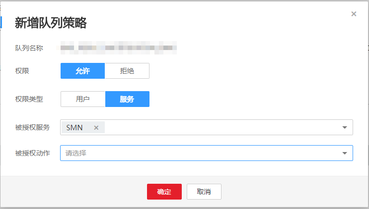

# 为什么用户向DMS服务的消息队列发布消息不成功？

首先您需确认DMS服务的该消息队列是否给SMN授权。若未授权，请执行以下操作步骤；若确认已授权，可能由于网络不稳定等其他原因造成，请联系客服确认。

1.  登录管理控制台。
2.  选择“应用服务” \> “分布式消息服务”。

    进入分布式消息服务页面。

3.  在队列列表，选择您使用的队列，单击队列名称。进入队列基本信息页面。
4.  在队列策略区域单击 “新增队列策略”。

    在弹出的对话框中，“权限”选择“允许”，“权限类型”选择“服务”，“被授权服务”选择“SMN”，根据您的需要选择“被授权动作”。

5.  单击“确定”。

    **图 1**  新增队列策略  
    

