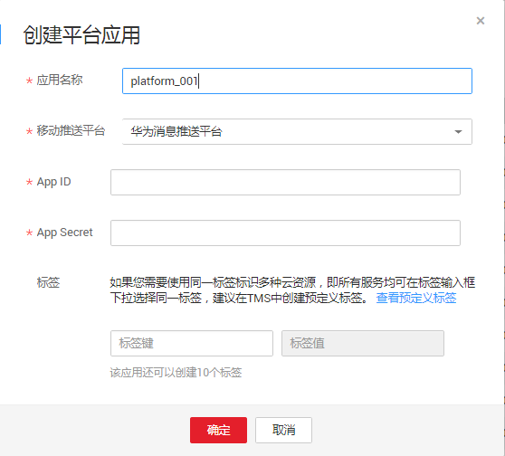
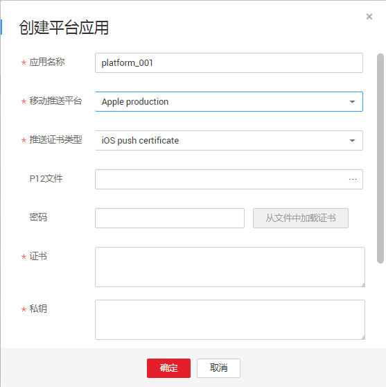
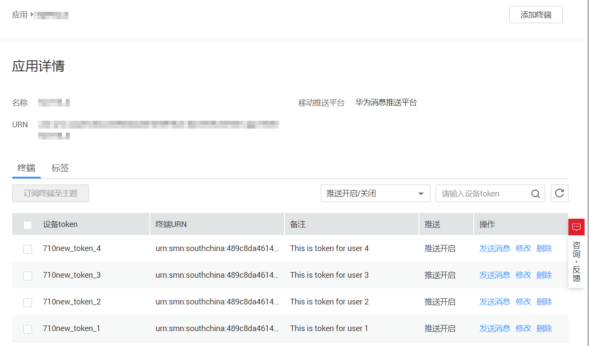

# 创建平台应用

## 前提条件

-   若使用HMS，已获取到PUSH服务参数（APP ID和APP SECRET），获取方式请参见[HMS入门](HMS入门.md)。
-   若使用APNS，已获取到P12格式iOS推送证书及其密码。

## 操作步骤

1.  登录管理控制台。
2.  在管理控制台左上角单击图标，选择区域和项目。
3.  选择“应用服务” \> “消息通知服务”。

    进入消息通知服务页面。

4.  在左侧导航栏，选择“移动推送“。

    进入移动推送页面。

5.  在移动推送页面，单击“创建平台应用“，开始创建平台应用。

    此时将显示“创建平台应用”对话框。

    -   移动推送平台为华为消息推送平台，参数说明请参见[表1](#table1733410171414)。

        **图 1**  创建平台应用  
        

        **表 1**  创建平台应用参数说明

        
        <table><thead align="left"><tr id="row1033480141412"><th class="cellrowborder" valign="top" width="19%" id="mcps1.2.3.1.1">
参数

        </th>
        <th class="cellrowborder" valign="top" width="81%" id="mcps1.2.3.1.2">
说明

        </th>
        </tr>
        </thead>
        <tbody><tr id="row833412010145"><td class="cellrowborder" valign="top" width="19%" headers="mcps1.2.3.1.1 ">
应用名称

        </td>
        <td class="cellrowborder" valign="top" width="81%" headers="mcps1.2.3.1.2 ">
创建的平台应用名称，用户可自定义名称，规范如下：

        <ul id="zh-cn_topic_0043394871_ul40971925153757"><li>只能包含字母、数字和下划线(_)。</li><li>名称长度限制在1-64字符之间。</li><li>应用名称为平台应用的唯一标识，一旦创建后不能再修改。</li></ul>
        </td>
        </tr>
        <tr id="row2342115214268"><td class="cellrowborder" valign="top" width="19%" headers="mcps1.2.3.1.1 ">
移动推送平台

        </td>
        <td class="cellrowborder" valign="top" width="81%" headers="mcps1.2.3.1.2 ">
选择华为消息推送平台

        </td>
        </tr>
        <tr id="row1233418051419"><td class="cellrowborder" valign="top" width="19%" headers="mcps1.2.3.1.1 ">
App ID

        </td>
        <td class="cellrowborder" valign="top" width="81%" headers="mcps1.2.3.1.2 ">
为PUSH服务参数

        </td>
        </tr>
        <tr id="row93346013146"><td class="cellrowborder" valign="top" width="19%" headers="mcps1.2.3.1.1 ">
App Secret

        </td>
        <td class="cellrowborder" valign="top" width="81%" headers="mcps1.2.3.1.2 ">
为PUSH服务参数

        </td>
        </tr>
        <tr id="row7997184012249"><td class="cellrowborder" valign="top" width="19%" headers="mcps1.2.3.1.1 ">
标签

        </td>
        <td class="cellrowborder" valign="top" width="81%" headers="mcps1.2.3.1.2 ">
标签由标签“键”和标签“值”组成，用于标识云资源，可对云资源进行分类和搜索。

        <ul id="ul1560610134435"><li>键的长度最大36字符，值的长度最大43字符。不能包含“=”、“*”、“&lt;”、“&gt;”、“\”、“,”、“|”、“/”，且首尾字符不能为空格。</li><li>每个平台应用最多可创建10个标签。</li></ul>
        </td>
        </tr>
        </tbody>
        </table>

    -   移动推送平台为Apple production或者Apple development，参数说明请参见[表2](#table010418511201)。

        **图 2**  创建平台应用  
        

        **表 2**  创建平台应用参数说明

        
        <table><thead align="left"><tr id="row131031053206"><th class="cellrowborder" valign="top" width="25%" id="mcps1.2.3.1.1">
参数

        </th>
        <th class="cellrowborder" valign="top" width="75%" id="mcps1.2.3.1.2">
说明

        </th>
        </tr>
        </thead>
        <tbody><tr id="row510320532011"><td class="cellrowborder" valign="top" width="25%" headers="mcps1.2.3.1.1 ">
应用名称

        </td>
        <td class="cellrowborder" valign="top" width="75%" headers="mcps1.2.3.1.2 ">
创建的平台应用名称，用户可自定义名称，规范如下：

        <ul id="ul13103852205"><li>只能包含字母、数字和下划线(_)。</li><li>名称长度限制在1-64字符之间。</li><li>应用名称为平台应用的唯一标识，一旦创建后不能再修改。</li></ul>
        </td>
        </tr>
        <tr id="row141049562013"><td class="cellrowborder" valign="top" width="25%" headers="mcps1.2.3.1.1 ">
移动推送平台

        </td>
        <td class="cellrowborder" valign="top" width="75%" headers="mcps1.2.3.1.2 "><ul id="ul7104125132018"><li>Apple production：为已发布上架的应用程序提供移动推送服务</li><li>Apple development：为正在开发调试的应用程序提供移动推送服务</li></ul>
        </td>
        </tr>
        <tr id="row1310435162015"><td class="cellrowborder" valign="top" width="25%" headers="mcps1.2.3.1.1 ">
推送证书类型

        </td>
        <td class="cellrowborder" valign="top" width="75%" headers="mcps1.2.3.1.2 ">
目前仅支持iOS push certificate

        </td>
        </tr>
        <tr id="row101040519205"><td class="cellrowborder" valign="top" width="25%" headers="mcps1.2.3.1.1 ">
P12文件

        </td>
        <td class="cellrowborder" valign="top" width="75%" headers="mcps1.2.3.1.2 ">
为P12格式的iOS证书

        </td>
        </tr>
        <tr id="row18104125182012"><td class="cellrowborder" valign="top" width="25%" headers="mcps1.2.3.1.1 ">
密码

        </td>
        <td class="cellrowborder" valign="top" width="75%" headers="mcps1.2.3.1.2 ">
为P12格式的iOS证书的密码

        </td>
        </tr>
        <tr id="row1710414522017"><td class="cellrowborder" valign="top" width="25%" headers="mcps1.2.3.1.1 ">
证书

        </td>
        <td class="cellrowborder" valign="top" width="75%" headers="mcps1.2.3.1.2 ">
当您选择好P12格式的iOS证书和输入iOS证书的密码后，单击“从文件中加载证书”，会自动在此处生成证书。

        </td>
        </tr>
        <tr id="row31044517206"><td class="cellrowborder" valign="top" width="25%" headers="mcps1.2.3.1.1 ">
私钥

        </td>
        <td class="cellrowborder" valign="top" width="75%" headers="mcps1.2.3.1.2 ">
同“证书”，当您选择好P12格式的iOS证书和输入iOS证书的密码后，单击“从文件中加载证书”，会自动在此处生成私钥。

        </td>
        </tr>
        <tr id="row4104253207"><td class="cellrowborder" valign="top" width="25%" headers="mcps1.2.3.1.1 ">
标签

        </td>
        <td class="cellrowborder" valign="top" width="75%" headers="mcps1.2.3.1.2 ">
标签由标签“键”和标签“值”组成，用于标识云资源，可对云资源进行分类和搜索。

        <ul id="ul121048514208"><li>键的长度最大36字符，值的长度最大43字符。不能包含“=”、“*”、“&lt;”、“&gt;”、“\”、“,”、“|”、“/”，且首尾字符不能为空格。</li><li>每个主题最多可创建10个标签。</li></ul>
        </td>
        </tr>
        </tbody>
        </table>

6.  单击“确定”。

    平台应用创建成功后，系统会自动生成平台应用URN，平台应用URN是平台应用的唯一资源标识，不可修改。新创建的平台应用将显示在平台应用列表中。

7.  单击应用名称，可查看平台应用的详情（包括应用名称、URN、所添加的终端、标签及终端URN）。

    **图 3**  平台应用详情  
    

