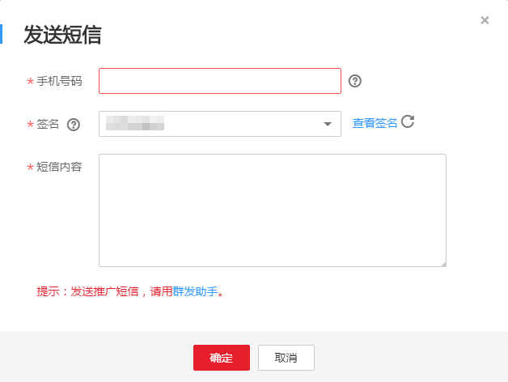
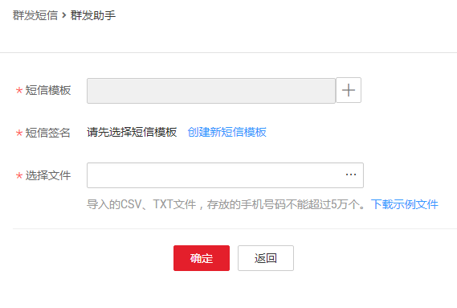

# 发送短信

> **说明：**   
>本服务已于2018.05.14停止申请新的短信签名。目前仅为2018.05.14之前拥有短信签名的用户提供短信发送功能。如果您需使用短信发送功能，请移步至“云通信-消息&短信”，感谢您的支持。  

## 发送通知/验证码类短信

1.  登录管理控制台。
2.  在管理控制台左上角单击图标，选择区域和项目。
3.  选择“应用服务” \> “消息通知服务”。

    进入消息通知服务页面。

4.  在左侧导航栏，单击“短信”。
5.  在短信页面，单击“发送短信”。

    在弹出的对话框中指定接收短信的手机号码、选择签名并输入短信内容。参数说明如[表1](#table105051171836)所示。

    **图 1**  发送短信  
    

    **表 1**  发送短信参数说明

    
    <table><thead align="left"><tr id="row666999001836"><th class="cellrowborder" valign="top" width="28.01%" id="mcps1.2.3.1.1">
参数

    </th>
    <th class="cellrowborder" valign="top" width="71.99%" id="mcps1.2.3.1.2">
参数说明

    </th>
    </tr>
    </thead>
    <tbody><tr id="row456813231836"><td class="cellrowborder" valign="top" width="28.01%" headers="mcps1.2.3.1.1 ">
手机号码

    </td>
    <td class="cellrowborder" valign="top" width="71.99%" headers="mcps1.2.3.1.2 ">
接收短信消息的手机号码。

    
手机号码输入规则：+[国家码][手机号码]，国内手机号码可省略+[国家码]，直接输入手机号码。

    
例如：+8600000000000、8600000000000、00000000000。

    </td>
    </tr>
    <tr id="row1161862018633"><td class="cellrowborder" valign="top" width="28.01%" headers="mcps1.2.3.1.1 ">
签名

    </td>
    <td class="cellrowborder" valign="top" width="71.99%" headers="mcps1.2.3.1.2 ">
短信签名是根据用户身份创建的标识，一般是公司名称或者产品名称。

    
选择已创建的短信签名。

    </td>
    </tr>
    <tr id="row54989077133222"><td class="cellrowborder" valign="top" width="28.01%" headers="mcps1.2.3.1.1 ">
短信内容

    </td>
    <td class="cellrowborder" valign="top" width="71.99%" headers="mcps1.2.3.1.2 ">
短信内容长度不超过490个字符。

    
计算短信字数时，包含短信签名。当短信字数不超过70时，按照70字/条计费。当短信字数超过70时，即为长短信，每条按照67字/条计算。

    </td>
    </tr>
    </tbody>
    </table>

6.  单击“确定”。

    短信内容将发送到指定的手机上。同一个手机号码限制1小时内最多发送60条短信，12小时最多发200条短信。

## 发送推广类短信

用户通过群发助手发送推广类短信。

群发助手是快速、便捷、无需开发程序的页面发送工具，导入手机号码，您可以批量发送推广短信。发送推广类短信前，用户必须拥有可用的推广类短信签名和短信模板。

1.  登录管理控制台。
2.  在管理控制台左上角单击图标，选择区域和项目。
3.  选择“应用服务” \> “消息通知服务”。

    进入消息通知服务页面。

4.  在左侧导航栏，选择“短信 \> 群发助手”。
5.  进入“群发助手”页面，单击“群发短信”。

    在群发助手页面，选择短信模板，导入存放手机号的文件。

    **图 2**  群发短信  
    

    > **说明：**   
    >-   “选择文件”中，导入的CSV、TXT文件存放的是您要发送短信的手机号码。群发助手支持一次性向5万个手机号码发送短信，请确保导入的文件存放的手机号码个数不超过5万个。  
    >-   导入前，需将CSV文件的单元格格式设置为“文本”。  

