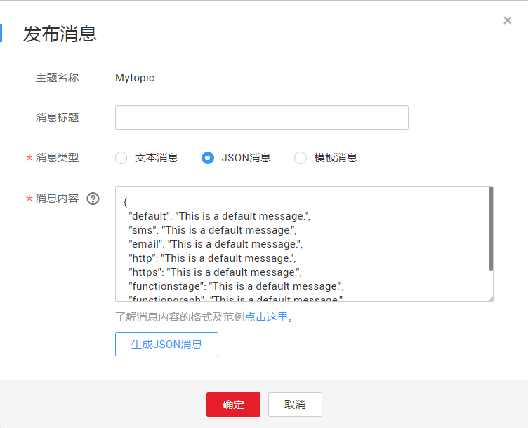

# 向主题发布JSON消息

## 操作场景

如果您需要向不同的订阅协议发送不同的内容，可以向主题发布JSON消息，它可以定义分别向短信、邮件、DMS和HTTP\(S\)订阅协议发送不同内容。

## 前提条件

所有的订阅终端必须确认订阅才能收到推送消息，未确认的订阅终端不会收到消息。

## 向主题发布JSON消息

1.  登录管理控制台。
2.  在管理控制台左上角单击图标，选择区域和项目。
3.  选择“应用服务” \> “消息通知服务”。

    进入消息通知服务页面。

4.  在左侧导航栏，选择“主题管理” \> “主题”。

    进入主题页面。

5.  在主题列表中，选择您要向其发布消息的主题，在右侧“操作”栏单击“发布消息”。
6.  在弹出的发布消息对话框中，主题名称为已选择的需要发布消息的主题名称，不可修改。其它参数根据界面提示填写。填写说明请参考[表1](向主题发布文本消息.md#table616755201736)。

    此处“消息类型”选择“JSON消息”，“消息内容”可以手动输入JSON格式的消息，也可以通过工具自动生成JSON格式的消息。消息内容的大小不超过256KB。

    -   手动输入JSON格式的消息，JSON格式的规范请参考[JSON格式消息说明](JSON格式消息说明.md)。
    -   通过工具自动生成JSON格式的消息，请参考步骤[7](#li59465700211512)~[10](#li3542952114596)。

7.  单击“生成JSON消息”。
8.  在弹出的对话框中，在“消息”框中输入内容“This is a default message.”，在“协议”处勾选所有协议。

    选择不同的协议，生成的JSON格式消息的大小不同。此处输入消息内容后，系统会自动计算已输入内容的字节数、生成的JSON格式消息的字节数以及剩余可输入的字节数。生成的JSON格式消息的字节数包含消息框中显示的花括号、双引号、空格、回车、协议名称和消息内容累计字节数。JSON格式消息的计算方法，请参见[JSON格式消息说明](JSON格式消息说明.md)的[JSON消息计算](JSON格式消息说明.md#section11977745123756)部分。

9.  单击“确定”，系统自动生成JSON消息并显示在消息内容框中。如[图1](#fig121037817209)所示。

    **图 1**  JSON消息  
    

10. 您可以在生成的各个协议的消息内容中手动修改消息，这样就可以实现向不同协议发送不同的消息内容。系统生成JSON格式的消息时默认生成“default”，当匹配不到消息协议时，按“default”中的内容发送。关于JSON格式的消息描述，请参考[JSON格式消息说明](JSON格式消息说明.md)。
11. 单击“确定”。

    消息将推送至不同的订阅终端。各个终端接收到的消息内容说明请参考《消息通知服务用户指南》的附录“不同协议消息说明”部分。

