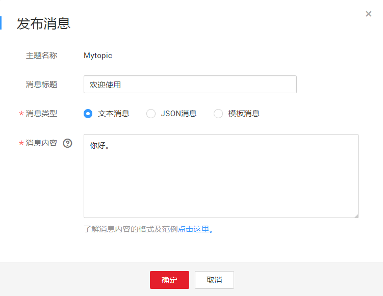

# 向主题发布文本消息

## 操作场景

文本消息是指将消息内容以文本的形式发送到订阅终端。

## 前提条件

所有的订阅终端必须确认订阅才能收到推送消息，未确认的订阅终端不会收到消息。

## 向主题发布文本消息

1.  登录管理控制台。
2.  在管理控制台左上角单击图标，选择区域和项目。
3.  选择“应用服务” \> “消息通知服务”。

    进入消息通知服务页面。

4.  在左侧导航栏，选择“主题管理” \> “主题”。

    进入主题页面。

5.  在主题列表中，选择您要向其发布消息的主题，在右侧“操作”栏单击“发布消息”。
6.  在弹出的发布消息对话框中，主题名称为已选择的需要发布消息的主题名称，不可修改。其它参数根据界面提示填写。填写说明如[表1](#table616755201736)所示。

    **表 1**  发布消息参数说明

    
    <table><thead align="left"><tr id="row584325251736"><th class="cellrowborder" valign="top" width="26.88%" id="mcps1.2.3.1.1">
<strong id="b502916561736">参数</strong>

    </th>
    <th class="cellrowborder" valign="top" width="73.11999999999999%" id="mcps1.2.3.1.2">
<strong id="b211779481736">说明</strong>

    </th>
    </tr>
    </thead>
    <tbody><tr id="row24022921736"><td class="cellrowborder" valign="top" width="26.88%" headers="mcps1.2.3.1.1 ">
消息标题

    </td>
    <td class="cellrowborder" valign="top" width="73.11999999999999%" headers="mcps1.2.3.1.2 ">
消息的标题，长度必须少于512字节。可不填写。

    </td>
    </tr>
    <tr id="row645771531736"><td class="cellrowborder" valign="top" width="26.88%" headers="mcps1.2.3.1.1 ">
消息类型

    </td>
    <td class="cellrowborder" valign="top" width="73.11999999999999%" headers="mcps1.2.3.1.2 ">
消息格式有三种，分别为“文本消息”、“JSON消息”和“模板消息”。每次发布消息只可选取其中一种。

    <ul id="ul37120136132048"><li>“文本消息”：按文本格式发送的消息。</li><li>“JSON消息”：按JSON格式发送的消息。</li><li>“模板消息”：按模板格式发送的消息。模板定义请参考<a href="消息模板管理.md">消息模板管理</a>。</li></ul>
    </td>
    </tr>
    <tr id="row45964848125529"><td class="cellrowborder" valign="top" width="26.88%" headers="mcps1.2.3.1.1 ">
消息内容

    </td>
    <td class="cellrowborder" valign="top" width="73.11999999999999%" headers="mcps1.2.3.1.2 ">
消息的内容。消息内容不能为空且大小不超过256KB。

    </td>
    </tr>
    </tbody>
    </table>

    消息内容格式如[图1](#fig3951246417347)所示。

    **图 1**  文本消息范例  
    

7.  单击“确定”。

    消息将推送至不同的订阅终端。各个终端接收到的消息内容说明请参考《消息通知服务用户指南》的附录“不同协议消息说明”部分。

