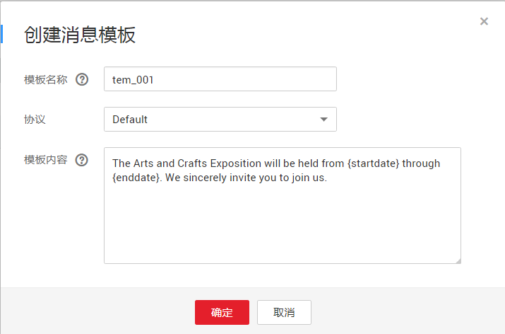
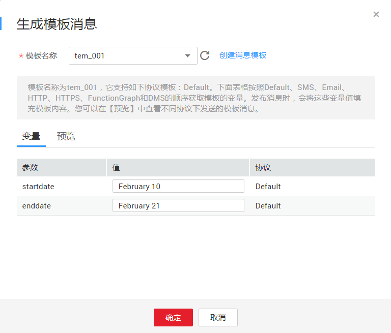
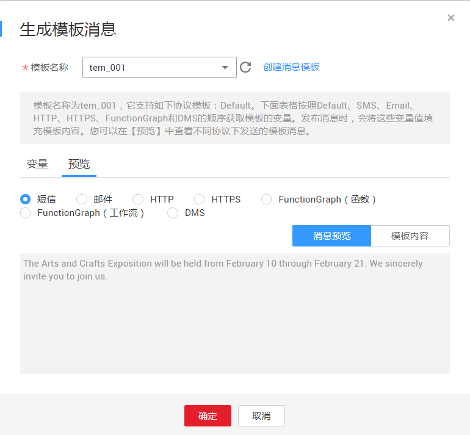
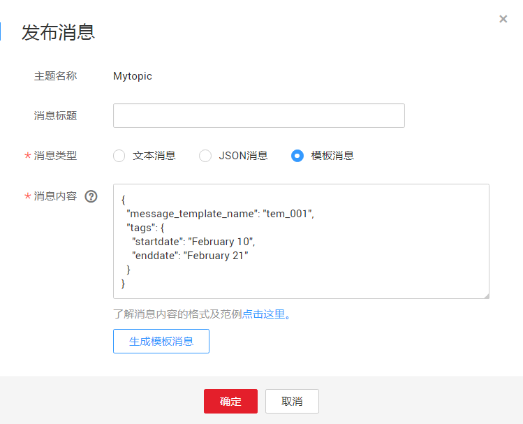

# 向主题发布模板消息

## 操作场景

消息模板指消息的固定格式。如果您要发布的消息内容丰富，并且这条消息需要多次发布，每次发布时需要变更的内容极少，此时您可以套用已创建的消息模板向订阅者发送消息。

在相同的消息模板名称下面，可创建一个或多个不同协议类型的消息模板来适配不同协议的订阅者，但必须包含一个Default协议类型的模板。不同协议类型的消息模板可以设置不同的模板内容，使用\{tag\}占位符代替变量。如果没有预置的Default协议的模板，将不允许发送该模板。

使用模板格式发送消息时，需要选择模板名称，名称选定后，系统会按照Default、SMS、Email、HTTP、HTTPS、FunctionGraph（函数）、应用、DMS的协议顺序，将该模板名称下不同协议的所有模板内容中的\{tag\}标签列出，重复的\{tag\}只列出一次，并在右侧显示拥有该\{tag\}的协议名称。设置\{tag\}值之后，消息通知服务会自动替换模板的\{tag\}标签为对应的参数值。如果\{tag\}没有设置参数值，模板内容不做替换。消息通知服务会按照模板名称和订阅者协议类型获取模板内容，如果对应订阅协议的模板内容不存在，将使用Default模板内容发送。

在这一部分中，您可以按照模板格式进行消息推送至您设定的订阅终端地址。在发送模板消息之前，您需要先创建好消息模板，关于消息模板的详细信息请参见《消息通知服务用户指南》的“消息模板管理”章节。

## 前提条件

所有的订阅终端必须确认订阅才能收到推送消息，未确认的订阅终端不会收到消息。

## 创建模板

1.  登录管理控制台。
2.  在管理控制台左上角单击图标，选择区域和项目。
3.  选择“管理与监管” \> “消息通知服务”。

    进入消息通知服务页面。

4.  在左侧导航栏，选择“主题管理” \>“消息模板”。
5.  请参见[消息模板管理](消息模板管理.md)的[创建模板](消息模板管理.md#section66624127194914)步骤创建消息模板。

    例如使用以下信息创建模板

    -   模板名称：“tem\_001”
    -   协议：“Default”
    -   模板内容：“The Arts and Crafts Exposition will be held from \{startdate\} through \{enddate\}. We sincerely invite you to join us. ”

        

## 向主题发布模板消息

1.  登录管理控制台。
2.  在管理控制台左上角单击图标，选择区域和项目。
3.  选择“管理与监管” \> “消息通知服务”。

    进入消息通知服务页面。

4.  在左侧导航栏，选择“主题管理” \> “主题”。

    进入主题页面。

5.  在主题列表中，选择您要向其发布消息的主题，在右侧“操作”栏单击“发布消息”。
6.  在弹出的发布消息对话框中，主题名称为已选择的需要发布消息的主题名称，不可修改。其它参数根据界面提示填写。

    此处“消息类型”选择“模板消息”，“消息内容”可以手动输入模板消息，也可以通过工具自动生成模板格式的消息。消息内容不能为空且大小不超过256KB。

    -   手动输入模板格式的消息，模板格式规范请参见《消息通知服务用户指南》的附录“模板格式消息说明”部分。
    -   通过工具自动生成模板格式的消息，请参见步骤[7](#li37303092212221)\~[10](#li3929025721230)。

7.  单击“生成模板消息”。
8.  在弹出的对话框中选择模板“tem\_001”并在“变量”页签中设置“值”。

    系统自动将设置的值替换，其他内容则与模板内容保持一致。此处选择的模板名称下只有Default协议的模板，则该主题下所有已确认的订阅终端地址均可收到该模板消息。如[图1](#fig139772771950)所示。

    **图 1**  生成消息模板  
    

9.  选择“预览”页签，单击“消息预览”，预览模板消息。

    该条模板消息的消息内容为“The Arts and Crafts Exposition will be held from February 10 through February 21. We sincerely invite you to join us. ”，如[图2](#fig42690758152014)所示。

    **图 2**  预览模板消息  
    

10. 单击“确定”。

    生成的消息内容显示模板名称和所有\{tag\}标签。如[图3](#fig2971835413465)所示。

    **图 3**  模板消息范例  
    

11. 单击“确定”。

    消息将推送至不同的订阅终端。各个终端接收到的消息内容说明请参考《消息通知服务用户指南》的附录“不同协议消息说明”部分。

