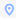
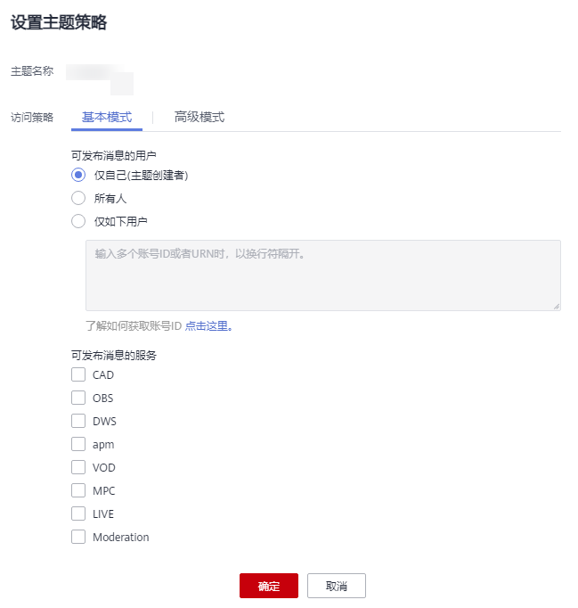

# 基本模式

只有主题创建者拥有设置主题访问策略的权限。通过主题策略的设置，您可授权或拒绝云服务或其他用户对主题资源进行特定类型操作，如查询主题详情、发布消息等。授权其他用户后，主题创建者依然可以操作该主题。

## 设置主题策略

1.  登录管理控制台。
2.  在管理控制台左上角单击图标，选择区域和项目。
3.  选择“应用服务” \> “消息通知服务”。

    进入消息通知服务页面。

4.  在左侧导航栏，选择“主题管理” \> “主题”。

    进入主题页面。

5.  在主题列表中，选择一个主题，单击右侧“操作”栏的“更多”，在下拉列表中选择“设置主题策略”修改主题。
6.  在弹出的对话框中，设置访问策略为基本模式的主题策略，如[图1](#fig2922559162717)。

    基本模式只可对用户和服务设置发布消息的操作权限，详细说明请参见[表1](#table41411027111244)。

    高级模式可使用策略语言配置更加灵活的访问策略。详细说明请参见[高级模式](高级模式.md)。

    **图 1**  基本模式  
    

    **表 1**  基本模式说明

    
    <table><thead align="left"><tr id="row13344231111244"><th class="cellrowborder" valign="top" width="14.141414141414144%" id="mcps1.2.4.1.1">
<strong id="b4426225716144">策略对象</strong>

    </th>
    <th class="cellrowborder" valign="top" width="22.222222222222225%" id="mcps1.2.4.1.2">
<strong id="b2847308916144">参数设置</strong>

    </th>
    <th class="cellrowborder" valign="top" width="63.63636363636363%" id="mcps1.2.4.1.3">
<strong id="b2461889016144">说明</strong>

    </th>
    </tr>
    </thead>
    <tbody><tr id="row18473302111244"><td class="cellrowborder" rowspan="3" valign="top" width="14.141414141414144%" headers="mcps1.2.4.1.1 ">
可发布消息的用户

    </td>
    <td class="cellrowborder" valign="top" width="22.222222222222225%" headers="mcps1.2.4.1.2 ">
仅自己（主题创建者）

    </td>
    <td class="cellrowborder" valign="top" width="63.63636363636363%" headers="mcps1.2.4.1.3 ">
仅主题创建者有权限向该主题发布消息。

    </td>
    </tr>
    <tr id="row11395712111244"><td class="cellrowborder" valign="top" headers="mcps1.2.4.1.1 ">
所有人

    </td>
    <td class="cellrowborder" valign="top" headers="mcps1.2.4.1.2 ">
所有用户均有权限向该主题发布消息。

    </td>
    </tr>
    <tr id="row23505339111244"><td class="cellrowborder" valign="top" headers="mcps1.2.4.1.1 ">
仅如下用户

    </td>
    <td class="cellrowborder" valign="top" headers="mcps1.2.4.1.2 ">
设置可向该主题发布消息的用户。格式为urn:csp:iam::domainId:root。其中，domainId即为用户的的账号ID。

    
您只需填写用户的“账号ID”，其余内容由系统自动补全，输入完成后，单击“确定”。可输入多个ID，数量没有限制，但生成的策略总长度不超过30KB。

    
基本模式中配置的内容在高级模式中同步显示。如需要修改，也可在高级模式中修改，如何修改请参见<a href="高级模式.md">高级模式</a>。

    
“账号ID”的获取方式：登录消息通知服务控制台，单击右上角用户名下的“我的凭证”，可查看“账号ID”。

    </td>
    </tr>
    <tr id="row6059372111244"><td class="cellrowborder" rowspan="5" valign="top" width="14.141414141414144%" headers="mcps1.2.4.1.1 ">
可发布消息的服务

    </td>
    <td class="cellrowborder" valign="top" width="22.222222222222225%" headers="mcps1.2.4.1.2 ">
OBS

    </td>
    <td class="cellrowborder" rowspan="5" valign="top" width="63.63636363636363%" headers="mcps1.2.4.1.3 ">
勾选服务名称表示授权该云服务可对该主题进行操作。

    
 NOTE: 

默认情况云监控和Anti-DDoS拥有向所有用户的主题发布消息的权限。已获取授权的云服务如何使用SMN的详细信息请参见相应服务的用户指南。

    

    </td>
    </tr>
    <tr id="row739716584593"><td class="cellrowborder" valign="top" headers="mcps1.2.4.1.1 ">
AAD

    </td>
    </tr>
    <tr id="row10225521015"><td class="cellrowborder" valign="top" headers="mcps1.2.4.1.1 ">
APM

    </td>
    </tr>
    <tr id="row163651584018"><td class="cellrowborder" valign="top" headers="mcps1.2.4.1.1 ">
MTS

    </td>
    </tr>
    <tr id="row16584651305"><td class="cellrowborder" valign="top" headers="mcps1.2.4.1.1 ">
VOD

    </td>
    </tr>
    </tbody>
    </table>

