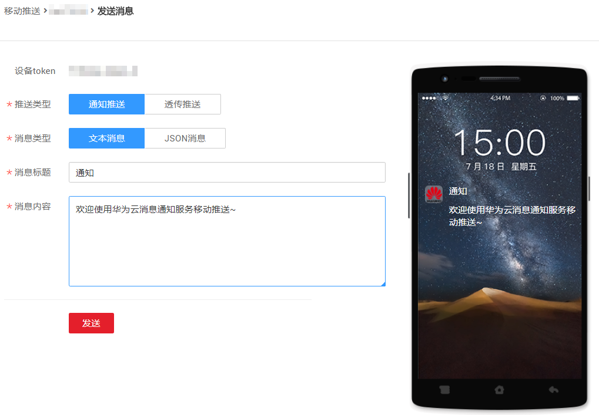

# 推送移动应用消息

## 前提条件

您已创建平台应用，并添加可用的终端，保证移动推送平台的证书没有过期。

## 推送透传消息

透传消息指消息通过移动推送平台到达移动终端时会透传给对应的App，由App自己控制消息呈现方式和点击动作。目前仅华为推送平台支持此消息类型。

1.  登录管理控制台。
2.  在管理控制台左上角单击图标，选择区域和项目。
3.  选择“管理与监管” \> “消息通知服务”。

    进入消息通知服务页面。

4.  在左侧导航栏，选择“移动推送“。

    进入移动推送页面。

5.  在平台应用列表中，选择“移动推送平台”为“华为消息推送平台”的平台应用，单击其应用名称，进入应用详情页面。
6.  在终端区域，选择一个设备token，单击右侧“操作“栏的“发送消息“，进入发送消息页面。
7.  在发送消息页面中，设备token不可修改。“推送类型”选择“透传推送”，“消息类型”选择“文本消息”或者“JSON消息”，再相应的输入消息内容和消息标题。

    **图 1**  推送透传消息  
    

8.  单击“发送”，发送透传消息成功。

## 推送通知消息

区别于透传消息，通知消息是指消息通过移动推送平台发送到移动终端时使用移动推送平台默认的消息呈现和点击动作。

1.  登录管理控制台。
2.  在管理控制台左上角单击图标，选择区域和项目。
3.  选择“管理与监管” \> “消息通知服务”。

    进入消息通知服务页面。

4.  在左侧导航栏，选择“移动推送“。

    进入移动推送页面。

5.  在平台应用列表中，选择一个平台应用，单击其应用名称，进入应用详情页面。
6.  在终端区域，选择一个设备token，单击右侧“操作“栏的“发送消息“，进入发送消息页面。
7.  在发送消息页面中，设备token不可修改。

    “推送类型”选择“通知推送”，“消息类型”选择“文本消息”或者“JSON消息”，相应的输入消息内容和消息标题。通知消息在移动终端的呈现形式会展现在右侧手机图片内。

    **图 2**  华为推送平台发送通知消息  
    

    **图 3**  APNS发送通知消息  
    

8.  单击“发送”，推送通知消息成功。

