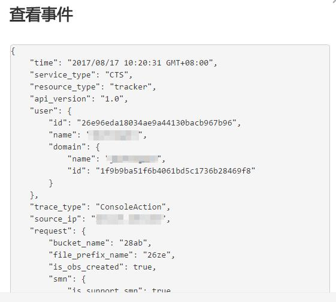

# 查看审计日志<a name="ZH-CN_TOPIC_0108868538"></a>

## 操作场景<a name="section1777133931415"></a>

在您开启了云审计服务后，系统开始记录云服务资源的操作。云审计服务管理控制台保存最近7天的操作记录。

本节介绍如何在云审计服务管理控制台查看或导出最近7天的操作记录。

## 操作步骤<a name="section105271416141516"></a>

1.  登录管理控制台。
2.  在管理控制台左上角单击图标，选择区域和项目。
3.  单击“服务列表”，选择“管理与部署 \> 云审计服务”，进入云审计服务信息页面。
4.  单击左侧导航树的“事件列表”，进入事件列表信息页面。
5.  事件列表支持通过筛选来查询对应的操作事件。当前事件列表支持四个维度的组合查询，详细信息如下：

    -   事件来源、资源类型和筛选类型。

        在下拉框中选择查询条件。

        其中筛选类型选择事件名称时，还需选择某个具体的事件名称。

        选择资源ID时，还需选择或者手动输入某个具体的资源ID。

        选择资源名称时，还需选择或手动输入某个具体的资源名称。

    -   操作用户：在下拉框中选择某一具体的操作用户，此操作用户指用户级别，而非租户级别。
    -   事件级别：可选项为“所有事件级别”、“normal”、“warning”、“incident”，只可选择其中一项。
    -   时间范围：可选择查询最近七天内任意时间段的操作事件。

6.  在需要查看的记录左侧，单击展开该记录的详细信息。
7.  在需要查看的记录右侧，单击“查看事件”，弹出的窗口显示该操作事件结构的详细信息。如[图1](#fig75757256213)所示。

    **图 1**  查看事件<a name="fig75757256213"></a>  
    


## 日志记录条目<a name="section54032088155336"></a>

云审计中每个日志条目都由一个JSON格式的事件组成。一个日志条目表示一条SMN接口请求，内容主要包括所请求的操作、操作的时间和日期、所操作的参数以及生成该请求的用户信息，其中用户信息来自统一身份认证服务。

以下示例显示了CreateTopic、DeleteTopic和UpdateTopic操作的CloudTrace记录条目。

```
{
   "time": "2017-02-15 14:21:50 GMT+08:00",
   "user": "xxx",
   "request": "xxx",
   "response": "xxx",
   "code": 200,
   "service_type": "SMN",
   "resource_type": "topic",
   "resource_id": "topicUrn instance",
   "source_ip": "127.0.0.1",
   "trace_name": "createTopic",
   "trace_rating": "normal",
   "trace_type": "ApiCall",
   "api_version": "2.0",
   "project_id": "tenantId instance",
   "record_time": "2017-02-15 14:21:50 GMT+08:00",
   "trace_id": "xxx"
}

{
   "time": "2017-02-15 14:12:15 GMT+08:00",
   "user": "xxx",
   "response": "xxx",
   "code": 200,
   "service_type": "SMN",
   "resource_type": "topic",
   "resource_id": "topicUrn instance",
   "source_ip": "127.0.0.1",
   "trace_name": "deleteTopic",
   "trace_rating": "normal",
   "trace_type": "ApiCall",
   "api_version": "2.0",
   "project_id": "tenantId instance",
   "record_time": "2017-02-15 14:12:15 GMT+08:00",
   "trace_id": "xxx"
}

{
   "time": "2017-02-13 15:38:30 GMT+08:00",
   "user": "xxx",
   "request": "xxx",
   "response": "xxx",
   "code": 200,
   "service_type": "SMN",
   "resource_type": "topic",
   "resource_id": "topicUrn instance",
   "source_ip": "127.0.0.1",
   "trace_name": "updateTopic",
   "trace_rating": "normal",
   "trace_type": "ApiCall",
   "api_version": "2.0",
   "project_id": "tenantId instance",
   "record_time": "2017-02-13 15:38:30 GMT+08:00",
   "trace_id": "xxx"
}
```

