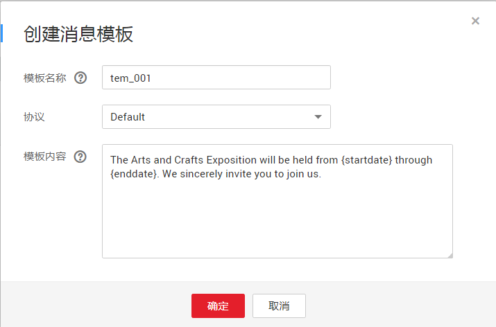

# 消息模板管理

## 操作场景

消息模板指消息的固定格式，发布消息时可以使用已创建的消息模板向订阅者发送消息。使用模板发送消息，发送时会自动替换模板变量为对应的参数值。

消息模板通过消息名称进行分组，消息名称下面可以根据不同的协议创建不同的模板。每个模板名称下面都必须要创建一个Default模板。当按照模板格式推送消息时，不同协议订阅者优先会选择模板名称下面对应的协议模板，如果对应的协议模板不存在，则采用默认Default的模板。如果没有预置的Default协议的模板，将不允许发送该模板。

当您需要发送模板格式的消息时，可参考本章节管理消息模板。

## 创建模板

1.  登录管理控制台。
2.  在管理控制台左上角单击图标，选择区域和项目。
3.  选择“应用服务” \> “消息通知服务”。

    进入消息通知服务页面。

4.  在左侧导航栏，选择“主题管理” \>“消息模板”。
5.  在消息模板页面。单击“创建消息模板”，开始创建消息模板。

    此时将显示“创建消息模板”页面。

    **图 1**  创建消息模板  
    

6.  在“模板名称”框中，输入模板名称，选择所使用的“协议”，在“模板内容”框中输入模板内容，参数说明如[表1](#table9567729153632)所示。

    **表 1**  创建消息模板参数说明

    
    <table><thead align="left"><tr id="row46643153153632"><th class="cellrowborder" valign="top" width="19.74%" id="mcps1.2.3.1.1">
<strong id="b633727016234">参数</strong>

    </th>
    <th class="cellrowborder" valign="top" width="80.25999999999999%" id="mcps1.2.3.1.2">
<strong id="b4355688916234">说明</strong>

    </th>
    </tr>
    </thead>
    <tbody><tr id="row15993813153632"><td class="cellrowborder" valign="top" width="19.74%" headers="mcps1.2.3.1.1 ">
模板名称

    </td>
    <td class="cellrowborder" valign="top" width="80.25999999999999%" headers="mcps1.2.3.1.2 ">
创建的模板名称，用户可自定义名称，规范如下：

    <ul id="ul40971925153757"><li>只能包含字母，数字，短横线(-)和下划线(_)，只能以字母或数字开头。</li><li>名称长度限制在1-64字节之间。</li><li>一旦创建后不能再修改。</li></ul>
    </td>
    </tr>
    <tr id="row62778644153632"><td class="cellrowborder" valign="top" width="19.74%" headers="mcps1.2.3.1.1 ">
协议

    </td>
    <td class="cellrowborder" valign="top" width="80.25999999999999%" headers="mcps1.2.3.1.2 ">
设置选择该模板推送消息时的接收终端类型，模板一旦选定不能再修改。

    
取值范围为：Default、短信、HTTP、HTTPS、FunctionGraph（函数）、Functiongraph（工作流）、DMS和邮件。

    
协议默认为“Default”。如果用户不选择协议，则使用默认值。

    </td>
    </tr>
    <tr id="row23418429162644"><td class="cellrowborder" valign="top" width="19.74%" headers="mcps1.2.3.1.1 ">
模板内容

    </td>
    <td class="cellrowborder" valign="top" width="80.25999999999999%" headers="mcps1.2.3.1.2 ">
用户可自定义模板内容。

    
请以{tag}作为占位符创建模板，在使用该模板发送消息时，{tag}可以被替换成具体内容。tag只能包含大写字母、小写字母、数字、-、_和.，且必须由大写字母、小写字母或数字开头。长度最长21个字符。

    
模板内容具体规则如下：

    <ul id="ul24327004104111"><li>模板内容仅支持纯文本格式。</li><li>模板内容不能为空。</li><li>模板内容大小至多为256KB。</li></ul>
    <ul id="ul36563140155946"><li>模板内容中允许最多90个（不重复的）标签和256个（计算重复的）标签。</li><li>发送消息时，每个标签允许的值大小为1KB.</li></ul>
    </td>
    </tr>
    </tbody>
    </table>

    例如使用以下信息创建模板

    -   模板名称：“tem\_001”
    -   协议：“Default”
    -   模板内容：“The Arts and Crafts Exposition will be held from \{startdate\} through \{enddate\}. We sincerely invite you to join us. ”

        

7.  单击“确定”。

    新创建的模板会显示在页面下方模板列表中。

## 修改模板

1.  在消息模板页面模板列表中，选择需要修改的消息模板名称。
2.  单击右侧“操作”栏的“修改”，修改“模板内容”。

## 删除模板

1.  在消息模板页面模板列表中，选择需要删除的消息模板名称。
2.  单击右侧“操作”栏的“删除”，确认删除该消息模板。

