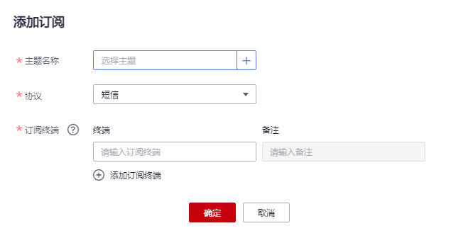

# 添加订阅

## 操作场景

订阅是您将订阅者注册到主题的操作。要接收发布至主题的消息，您必须订阅一个订阅终端到该主题。终端节点可以是手机号码、邮件地址、函数、DMS或HTTP\(S\)终端。为终端节点订阅主题且确认订阅后，终端节点能够接收到向该主题发布的所有消息。

您可以拥有多个主题，每个主题有多个订阅者。当您需要向创建的主题添加订阅者以及删除订阅等操作，或者向已获取授权的主题添加订阅者时，可参考本章节。

## 添加订阅

1.  登录管理控制台。
2.  在管理控制台左上角单击图标，选择区域和项目。
3.  选择“应用服务” \> “消息通知服务”。

    进入消息通知服务页面。

4.  在左侧导航栏，选择“主题管理” \>“订阅”。
5.  在订阅页面。单击“添加订阅”，开始添加消息订阅。

    此时将显示“添加订阅”页面。

    **图 1**  添加订阅  
    

6.  向指定主题添加订阅。

    单击“主题名称”输入框右侧的，在弹出的选择主题对话框中选择主题。

    在“协议”下拉框中选择订阅终端支持的协议，在“订阅终端”输入框中输入对应的订阅终端，填写说明如[表1](#table2272876216264)所示。  

    **表 1**  添加订阅参数说明

    
    <table><thead align="left"><tr id="row4550804216264"><th class="cellrowborder" valign="top" width="18.990000000000002%" id="mcps1.2.3.1.1">
<strong id="b5030070116264">参数</strong>

    </th>
    <th class="cellrowborder" valign="top" width="81.01%" id="mcps1.2.3.1.2">
<strong id="b2777129716264">说明</strong>

    </th>
    </tr>
    </thead>
    <tbody><tr id="row9669750155910"><td class="cellrowborder" valign="top" width="18.990000000000002%" headers="mcps1.2.3.1.1 ">
主题名称

    </td>
    <td class="cellrowborder" valign="top" width="81.01%" headers="mcps1.2.3.1.2 ">
在弹出的对话框中选择的主题的名称。

    </td>
    </tr>
    <tr id="row153044716264"><td class="cellrowborder" valign="top" width="18.990000000000002%" headers="mcps1.2.3.1.1 ">
协议

    </td>
    <td class="cellrowborder" valign="top" width="81.01%" headers="mcps1.2.3.1.2 ">
在下拉框中选择需要订阅终端支持的协议，提供的选项为“短信”、“邮件”、“HTTP”、“HTTPS”、“FunctionGraph（函数）”、“Functiongraph（工作流）”以及“DMS”。

    </td>
    </tr>
    <tr id="row3620920716264"><td class="cellrowborder" valign="top" width="18.990000000000002%" headers="mcps1.2.3.1.1 ">
订阅终端

    </td>
    <td class="cellrowborder" valign="top" width="81.01%" headers="mcps1.2.3.1.2 ">
订阅的终端地址，短信、邮件、HTTP以及HTTPS终端支持批量输入，批量添加时，每个终端地址占一行。最多可输入10个终端。

    <ul id="ul4684327816264"><li>选择“短信”终端，请输入有效手机号码。
输入规则为[+] [国家码][手机号码]。国内手机号码可省略[+]或[+] [国家码]。

    
例如：

    
+8600000000000

    
+8600000000001

    </li><li>选择“邮件”终端，请输入有效电子邮件地址。
例如：

    
username@example.com

    
username2@example.com

    </li><li>选择“HTTP”或“HTTPS”终端，请输入公网网址。
例如：

    
http://example.com/notification/action

    
http://example2.com/notification/action

    </li><li>选择“FunctionGraph（函数）”终端，表示订阅终端是一个函数，单击输入框右侧的选择订阅终端，在“版本”的下拉框中选择可用版本。</li><li>选择“Functiongraph（工作流）”终端，表示订阅终端是一组函数编排成的工作流，单击输入框右侧的选择订阅终端。</li><li>选择“DMS”终端，表示订阅终端是一个消息队列，单击输入框右侧的选择订阅终端。选择DMS队列时，需要在队列策略中给SMN服务授权“ProduceMessages”权限，具体操作请参考《分布式消息服务用户指南》中的<a href="http://support.huaweicloud.com/usermanual-dms/zh-cn_topic_0073338246.html" target="_blank" rel="noopener noreferrer">策略管理</a>。</li></ul>
    </td>
    </tr>
    </tbody>
    </table>

7.  单击“确定”。

    新增订阅将显示在页面下方的订阅列表中。

    > **说明：**   
    >-   为了防止恶意攻击订阅终端，我们会对订阅终端进行流控保护，触发流控规则后，消息通知服务不再发送订阅确认消息，具体的保护规则请参见《消息通知服务用户指南》的附录“订阅确认流控说明”部分。  
    >-   消息通知服务不会校验订阅终端是否真实存在。  
    >-   由于token在48小时内有效，所以订阅确认的链接在48小时内有效。  

