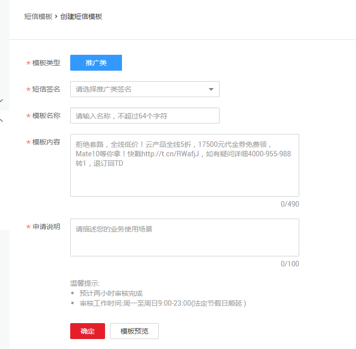

# 短信模板

短信模板是用户需要发送的短信内容，创建后内容不可更改，需审核通过之后才可使用。

> **说明：**   
>1.  格式规范要求  
>    -   推广短信内容后面需要添加退订方式，支持“TD、T”进行短信退订回复。  
>    -   鉴于特殊符号可能会导致短信出现乱码，不支持如￥、★以及包含可通过按键录入的组合型特殊符号，如^\_^&，?，√，※。  
>2.  内容规范要求  
>    禁止发送股票、移民、房地产、教育、培训、面试招聘、彩票、返利、贷款、催款、投资理财、赌博、中奖、一元夺宝、一元秒杀、A货、医疗、整形、美容、会所、酒吧、足浴、暴力、恐吓、色情、皮草、助考，商标注册、加群、加QQ或者加微信、贩卖个人信息、宣传短信通道、装修（含建材,家私）、游戏推广、会展推广、网站推广、优惠券类推广、卡类推广、保险推广、酒类、用户拉新、用户召回等类型的短信。  

## 操作场景

在发送推广类短信时，会使用短信模板。因此，在发送推广类短信前必须拥有可使用的短信模板。

## 创建短信模板

1.  登录管理控制台。
2.  在管理控制台左上角单击图标，选择区域和项目。
3.  选择“应用服务” \> “消息通知服务”。

    进入消息通知服务页面。

4.  在左侧导航栏，选择“短信 \> 短信模板“。
5.  在短信模板页面，单击“创建短信模板“，开始创建短信模板。参数说明如[表1](#table141914468197)所示。

    

    **表 1**  创建短信模板参数说明

    
    <table><thead align="left"><tr id="row19191246161912"><th class="cellrowborder" valign="top" width="32%" id="mcps1.2.3.1.1">
参数

    </th>
    <th class="cellrowborder" valign="top" width="68%" id="mcps1.2.3.1.2">
参数说明

    </th>
    </tr>
    </thead>
    <tbody><tr id="row2435141104"><td class="cellrowborder" valign="top" width="32%" headers="mcps1.2.3.1.1 ">
模板类型

    </td>
    <td class="cellrowborder" valign="top" width="68%" headers="mcps1.2.3.1.2 ">
为“推广类”。短信模板目前只支持推广类短信。

    </td>
    </tr>
    <tr id="row749811514013"><td class="cellrowborder" valign="top" width="32%" headers="mcps1.2.3.1.1 ">
短信签名

    </td>
    <td class="cellrowborder" valign="top" width="68%" headers="mcps1.2.3.1.2 ">
已通过审核的推广类短信签名。

    
模板创建成功后，若删除短信签名，关联的短信模板会失效。

    </td>
    </tr>
    <tr id="row2191246131914"><td class="cellrowborder" valign="top" width="32%" headers="mcps1.2.3.1.1 ">
模板名称

    </td>
    <td class="cellrowborder" valign="top" width="68%" headers="mcps1.2.3.1.2 ">
短信模板的名称，用户自定义。

    </td>
    </tr>
    <tr id="row5191134618199"><td class="cellrowborder" valign="top" width="32%" headers="mcps1.2.3.1.1 ">
模板内容

    </td>
    <td class="cellrowborder" valign="top" width="68%" headers="mcps1.2.3.1.2 ">
短信模板的内容，用户自定义。

    
用户需要发送的短信内容。短信模板创建完成后，模板内容不可再更改。

    
短信模板的内容中必须包含可用的签名名称，签名名称以括号括起来放在内容开头或者结尾。如【华为云】欢迎使用华为云，退订回TD。

    </td>
    </tr>
    <tr id="row0191184618195"><td class="cellrowborder" valign="top" width="32%" headers="mcps1.2.3.1.1 ">
申请说明

    </td>
    <td class="cellrowborder" valign="top" width="68%" headers="mcps1.2.3.1.2 ">
申请短信模板的用途，用户自行填写。

    </td>
    </tr>
    </tbody>
    </table>

6.  单击“模板预览”，可将短信模板模拟展示在手机终端。
7.  单击“确定”。

    成功创建短信模板。预计两小时审核完成，审核工作时间为周一至周日9:00-23:00（法定节假日顺延） 。

## 查看短信模板ID

短信模板ID在创建短信模板时由系统自动生成，是短信模板的唯一标识。查看短信模板ID请参考以下步骤。

1.  登录管理控制台。
2.  在管理控制台左上角单击图标，选择区域和项目。
3.  选择“应用服务” \> “消息通知服务”。

    进入消息通知服务页面。

4.  在左侧导航栏，选择“短信 \> 短信模板”。
5.  在短信模板页面的模板列表中，获取短信模板的模板ID

## 删除短信模板

1.  短信模板页面的模板列表中，选择需要删除的模板。
2.  单击右侧“操作”栏的“删除“，删除模板。

