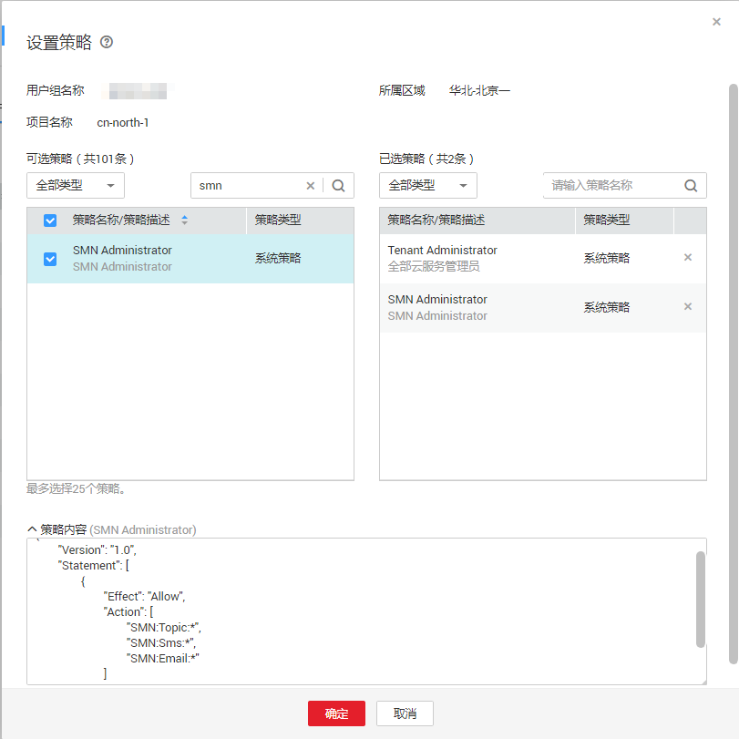

# 策略语法：RBAC<a name="smn_ug_0038"></a>

## 策略结构<a name="zh-cn_topic_0173533527_zh-cn_topic_0173481717_zh-cn_topic_0172268190_section1661242202715"></a>

策略结构包括：策略版本号（Version）、策略授权语句（Statement）和策略依赖（Depends）。

**图 1**  策略结构<a name="zh-cn_topic_0173533527_zh-cn_topic_0173481717_zh-cn_topic_0172268190_fig2641112616326"></a>  


## 策略语法<a name="zh-cn_topic_0173533527_section789713102221"></a>

如下以SMN服务的“SMN Administraor”为例，说明RBAC策略语法。



```
{
        "Version": "1.0",
        "Statement": [
                {
                        "Effect": "Allow",
                        "Action": [
                                "SMN:Topic:*",
                                "SMN:Sms:*",
                                "SMN:Email:*"
                        ]
                }
        ]
}
```

**表 1**  参数说明

<a name="zh-cn_topic_0173533527_table664091712223"></a>
<table><thead align="left"><tr id="zh-cn_topic_0173533527_row774317178225"><th class="cellrowborder" colspan="2" valign="top" id="mcps1.2.5.1.1"><p id="zh-cn_topic_0173533527_p1574311742218"><a name="zh-cn_topic_0173533527_p1574311742218"></a><a name="zh-cn_topic_0173533527_p1574311742218"></a>参数</p>
</th>
<th class="cellrowborder" valign="top" id="mcps1.2.5.1.2"><p id="zh-cn_topic_0173533527_p374331702213"><a name="zh-cn_topic_0173533527_p374331702213"></a><a name="zh-cn_topic_0173533527_p374331702213"></a>含义</p>
</th>
<th class="cellrowborder" valign="top" id="mcps1.2.5.1.3"><p id="zh-cn_topic_0173533527_p3743131782216"><a name="zh-cn_topic_0173533527_p3743131782216"></a><a name="zh-cn_topic_0173533527_p3743131782216"></a>值</p>
</th>
</tr>
</thead>
<tbody><tr id="zh-cn_topic_0173533527_row174371711227"><td class="cellrowborder" colspan="2" valign="top" headers="mcps1.2.5.1.1 "><p id="zh-cn_topic_0173533527_p1374313178226"><a name="zh-cn_topic_0173533527_p1374313178226"></a><a name="zh-cn_topic_0173533527_p1374313178226"></a>Version</p>
</td>
<td class="cellrowborder" valign="top" headers="mcps1.2.5.1.2 "><p id="zh-cn_topic_0173533527_p2743171713227"><a name="zh-cn_topic_0173533527_p2743171713227"></a><a name="zh-cn_topic_0173533527_p2743171713227"></a>策略的版本</p>
</td>
<td class="cellrowborder" valign="top" headers="mcps1.2.5.1.3 "><p id="zh-cn_topic_0173533527_p1374381762218"><a name="zh-cn_topic_0173533527_p1374381762218"></a><a name="zh-cn_topic_0173533527_p1374381762218"></a>固定为“1.0”</p>
</td>
</tr>
<tr id="zh-cn_topic_0173533527_row6743417182211"><td class="cellrowborder" rowspan="2" valign="top" width="12.261226122612262%" headers="mcps1.2.5.1.1 "><p id="zh-cn_topic_0173533527_p9743151772219"><a name="zh-cn_topic_0173533527_p9743151772219"></a><a name="zh-cn_topic_0173533527_p9743151772219"></a>Statement</p>
</td>
<td class="cellrowborder" valign="top" width="11.431143114311432%" headers="mcps1.2.5.1.1 "><p id="zh-cn_topic_0173533527_p5743217132215"><a name="zh-cn_topic_0173533527_p5743217132215"></a><a name="zh-cn_topic_0173533527_p5743217132215"></a>Action</p>
</td>
<td class="cellrowborder" valign="top" width="31.623162316231625%" headers="mcps1.2.5.1.2 "><p id="zh-cn_topic_0173533527_p4743191722216"><a name="zh-cn_topic_0173533527_p4743191722216"></a><a name="zh-cn_topic_0173533527_p4743191722216"></a>定义对SMN的具体操作。</p>
</td>
<td class="cellrowborder" valign="top" width="44.68446844684469%" headers="mcps1.2.5.1.3 "><p id="zh-cn_topic_0173533527_p3744141717228"><a name="zh-cn_topic_0173533527_p3744141717228"></a><a name="zh-cn_topic_0173533527_p3744141717228"></a>格式为：服务名:资源类型:操作</p>
<p id="zh-cn_topic_0173533527_p3744161714227"><a name="zh-cn_topic_0173533527_p3744161714227"></a><a name="zh-cn_topic_0173533527_p3744161714227"></a>"SMN:Topic:*"，表示对SMN的所有操作，其中SMN为服务名称；“*”为通配符，表示对SMN的Topic可以执行所有操作。</p>
</td>
</tr>
<tr id="zh-cn_topic_0173533527_row3744217122216"><td class="cellrowborder" valign="top" headers="mcps1.2.5.1.1 "><p id="zh-cn_topic_0173533527_p37441617192213"><a name="zh-cn_topic_0173533527_p37441617192213"></a><a name="zh-cn_topic_0173533527_p37441617192213"></a>Effect</p>
</td>
<td class="cellrowborder" valign="top" headers="mcps1.2.5.1.1 "><p id="zh-cn_topic_0173533527_p074461712215"><a name="zh-cn_topic_0173533527_p074461712215"></a><a name="zh-cn_topic_0173533527_p074461712215"></a>定义Action中所包含的具体操作是否允许执行。</p>
</td>
<td class="cellrowborder" valign="top" headers="mcps1.2.5.1.2 "><a name="zh-cn_topic_0173533527_ul8744151710225"></a><a name="zh-cn_topic_0173533527_ul8744151710225"></a><ul id="zh-cn_topic_0173533527_ul8744151710225"><li>Allow：允许执行。</li><li>Deny：不允许执行。</li></ul>
</td>
</tr>
<tr id="zh-cn_topic_0173533527_row107441617132219"><td class="cellrowborder" rowspan="2" valign="top" width="12.261226122612262%" headers="mcps1.2.5.1.1 "><p id="zh-cn_topic_0173533527_p1274411174221"><a name="zh-cn_topic_0173533527_p1274411174221"></a><a name="zh-cn_topic_0173533527_p1274411174221"></a>Depends</p>
</td>
<td class="cellrowborder" valign="top" width="11.431143114311432%" headers="mcps1.2.5.1.1 "><p id="zh-cn_topic_0173533527_p1774418172229"><a name="zh-cn_topic_0173533527_p1774418172229"></a><a name="zh-cn_topic_0173533527_p1774418172229"></a>catalog</p>
</td>
<td class="cellrowborder" valign="top" width="31.623162316231625%" headers="mcps1.2.5.1.2 "><p id="zh-cn_topic_0173533527_p5744111702213"><a name="zh-cn_topic_0173533527_p5744111702213"></a><a name="zh-cn_topic_0173533527_p5744111702213"></a>依赖的策略的所属服务。</p>
</td>
<td class="cellrowborder" valign="top" width="44.68446844684469%" headers="mcps1.2.5.1.3 "><p id="zh-cn_topic_0173533527_p974416175224"><a name="zh-cn_topic_0173533527_p974416175224"></a><a name="zh-cn_topic_0173533527_p974416175224"></a>服务名称</p>
<p id="zh-cn_topic_0173533527_p1174461711221"><a name="zh-cn_topic_0173533527_p1174461711221"></a><a name="zh-cn_topic_0173533527_p1174461711221"></a>例如：BASE</p>
</td>
</tr>
<tr id="zh-cn_topic_0173533527_row1174481715224"><td class="cellrowborder" valign="top" headers="mcps1.2.5.1.1 "><p id="zh-cn_topic_0173533527_p10744217192219"><a name="zh-cn_topic_0173533527_p10744217192219"></a><a name="zh-cn_topic_0173533527_p10744217192219"></a>display_name</p>
</td>
<td class="cellrowborder" valign="top" headers="mcps1.2.5.1.1 "><p id="zh-cn_topic_0173533527_p14744141715226"><a name="zh-cn_topic_0173533527_p14744141715226"></a><a name="zh-cn_topic_0173533527_p14744141715226"></a>依赖的策略的名称。</p>
</td>
<td class="cellrowborder" valign="top" headers="mcps1.2.5.1.2 "><p id="zh-cn_topic_0173533527_p7744617122218"><a name="zh-cn_topic_0173533527_p7744617122218"></a><a name="zh-cn_topic_0173533527_p7744617122218"></a>权限名称</p>
<p id="zh-cn_topic_0173533527_p2745417172211"><a name="zh-cn_topic_0173533527_p2745417172211"></a><a name="zh-cn_topic_0173533527_p2745417172211"></a>例如：Tenant Administrator</p>
</td>
</tr>
</tbody>
</table>

