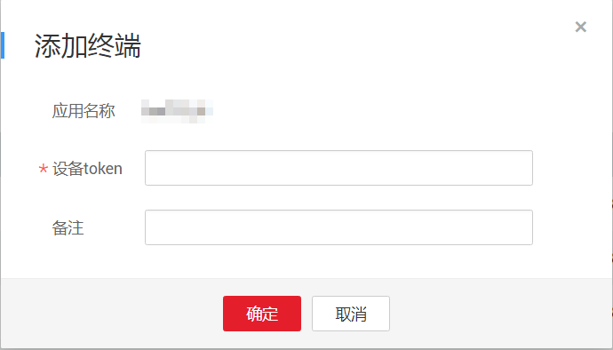
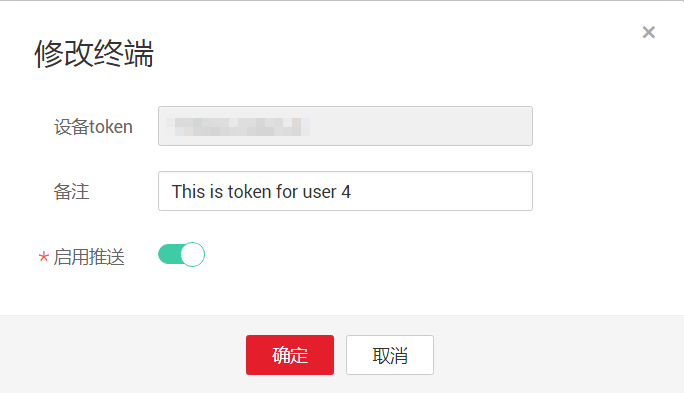
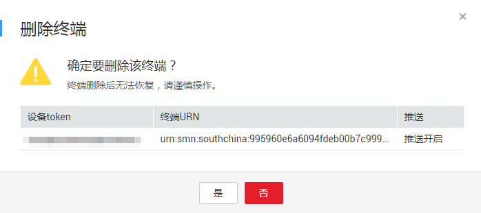

# 管理终端

## 前提条件

您已准备好移动终端设备的设备token。

## 向平台应用添加终端

1.  登录管理控制台。
2.  在管理控制台左上角单击图标，选择区域和项目。
3.  选择“应用服务” \> “消息通知服务”。

    进入消息通知服务页面。

4.  在左侧导航栏，选择“移动推送“。

    进入移动推送页面。

5.  在平台应用列表中，选择您要向其添加终端的平台应用，在右侧“操作”栏单击“添加终端”。

    此时将显示“添加终端”对话框，根据[表1](#table6346191114616)输入相应内容。

    **图 1**  添加终端  
    

    **表 1**  添加终端参数说明

    
    <table><thead align="left"><tr id="row123461418461"><th class="cellrowborder" valign="top" width="17%" id="mcps1.2.3.1.1">
参数

    </th>
    <th class="cellrowborder" valign="top" width="83%" id="mcps1.2.3.1.2">
说明

    </th>
    </tr>
    </thead>
    <tbody><tr id="row10346117465"><td class="cellrowborder" valign="top" width="17%" headers="mcps1.2.3.1.1 ">
设备token

    </td>
    <td class="cellrowborder" valign="top" width="83%" headers="mcps1.2.3.1.2 ">
移动终端设备的设备token，由移动推送平台生成。

    </td>
    </tr>
    <tr id="row1234620117463"><td class="cellrowborder" valign="top" width="17%" headers="mcps1.2.3.1.1 ">
备注

    </td>
    <td class="cellrowborder" valign="top" width="83%" headers="mcps1.2.3.1.2 ">
用户备注信息

    </td>
    </tr>
    </tbody>
    </table>

6.  单击“确定”。

    终端添加成功后，系统会自动生成终端URN，终端URN是终端的唯一资源标识，不可修改。

## 修改终端

1.  登录管理控制台。
2.  在管理控制台左上角单击图标，选择区域和项目。
3.  选择“应用服务” \> “消息通知服务”。

    进入消息通知服务页面。

4.  在左侧导航栏，选择“移动推送“。

    进入移动推送页面。

5.  在平台应用列表中，单击应用名称，进入应用详情页面。
6.  在终端区域，选择一个设备token，单击右侧“操作“栏的“修改“。
7.  在弹出框中，您可修改“备注“和选择不启用推送。

    > **说明：**   
    >若您选择不启用推送，您向该终端发送任何消息都会显示“发送失败”，请按需选择。  

    **图 2**  修改终端  
    

8.  单击“确定“，完成修改终端。

## 删除终端

1.  登录管理控制台。
2.  在管理控制台左上角单击图标，选择区域和项目。
3.  选择“应用服务” \> “消息通知服务”。

    进入消息通知服务页面。

4.  在左侧导航栏，选择“移动推送“。

    进入移动推送页面。

5.  在平台应用列表中，单击应用名称，进入应用详情页面。
6.  在终端区域，选择一个设备token，单击右侧“操作“栏的“删除“。
7.  在弹出的对话框中，单击“确定“，完成删除终端。

    **图 3**  删除终端  
    

