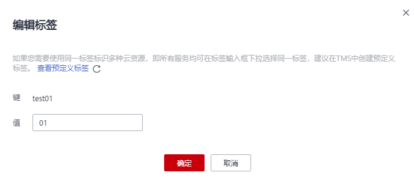

# 设置主题标签

## 操作场景

标签由标签“键”和标签“值”组成，用于标识云资源，可对云资源进行分类和搜索。

-   一个标签的“键”可以拥有多个标签“值”。
-   一个云资源不能拥有重复的标签“键”。

## 设置主题标签

1.  登录管理控制台。
2.  在管理控制台左上角单击图标，选择区域和项目。
3.  选择“应用服务” \> “消息通知服务”。

    进入消息通知服务页面。

4.  在左侧导航栏，选择“主题管理” \> “主题”。

    进入主题页面。

5.  在主题列表中，选择一个主题，单击主题名称，进入主题详情页面。
6.  单击主题详情页面下方区域的“标签“。
7.  单击“添加标签“，在弹出框中设置标签的“键“和“值“。

    **图 1**  添加标签  
    

    > **说明：**   
    >-   键的长度最大36字符，值的长度最大43 字符，只能包含大写字母、小写字母、数字和特殊字符（-\_），且首尾字符不能为空格。  
    >-   每个主题最多可创建10个标签。  

8.  单击“确定“，为主题设置标签成功。新添加的标签将显示在标签列表中。
9.  单击标签列表右侧“操作“栏下的“编辑“，可修改标签的值。

    **图 2**  编辑标签  
    

10. 单击标签列表右侧“操作“栏下的“删除“，在弹出框中单击“确定“，可删除标签。

    **图 3**  删除标签  
    

