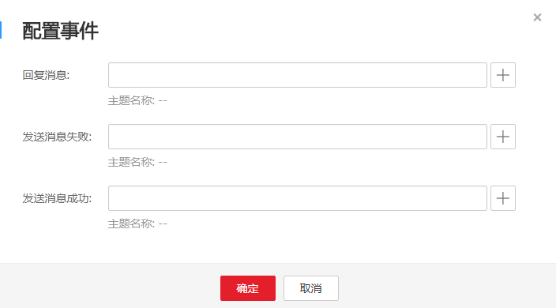

# 配置事件

## 操作场景

消息通知服务短信业务提供事件通知功能，支持将短信发送的结果以消息的方式异步通知给用户。用户可以通过配置事件的通知规则来指定在短信发送过程中触发不同的事件，将短信推送结果的信息发送到对应的接收终端中。配置事件通知规则可解决以下问题：

-   异步获取短信发送的结果，根据实际需求进行相应的处理，例如重新发送。
-   针对大批量的短信通知场景，可统计短信发送情况。
-   对短信发送情况进行监控，例如产生突发的频繁消息发送，可第一时间知晓。
-   短信发送结果的消息可以通过多种协议推送到不同的接收端。

## 配置事件

事件通知是基于消息通知服务的主题实现的，事件通知规则是由事件类型和消息接收终端两部分组成。

-   事件类型：配置了某种事件就是指关注短信发送过程中产生的所有该类型事件。短信推送的事件分为三种：回复消息、发送消息失败和发送消息成功。
-   消息接收终端：指定主题。指定主题后，如果规则匹配，消息就会发布到主题中。用户可以选择已创建的主题，或者先参考[创建主题](创建主题.md)新创建主题，再选择该主题。然后参考[订阅主题](订阅主题.md)向已选中的主题中添加订阅者。

配置事件请参考以下操作步骤。

1.  登录管理控制台。
2.  在管理控制台左上角单击图标，选择区域和项目。
3.  选择“应用服务” \> “消息通知服务”。

    进入消息通知服务页面。

4.  在左侧导航栏，单击“短信”。
5.  在短信页面，单击“配置事件”。

    在弹出的对话框中配置事件。单击右侧的为事件选择主题，一种事件规则只能指定一个主题。

    **图 1**  配置事件  
    

6.  单击“确定”。

    配置事件创建完，约5分钟左右生效。

    如需取消事件配置，清空对应事件配置并单击“确定”即可。

    > **说明：**   
    >短信回调事件字段说明请参见[短信回调事件字段说明](短信回调事件字段说明.md)。  

