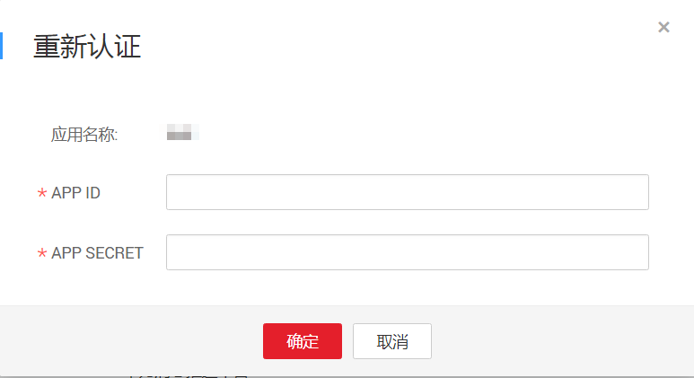
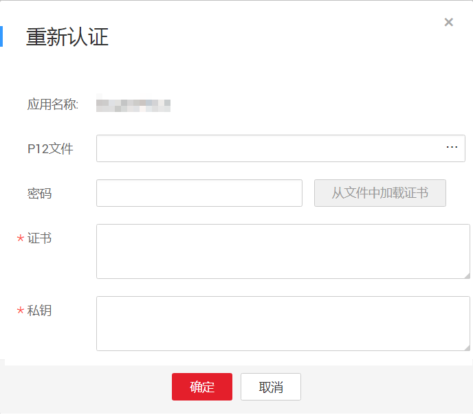

# 重新认证

## 操作场景

当证书过期或者PUSH服务过期时，在移动推送平台上重新申请证书或重新添加PUSH服务后，需在SMN控制台进行重新认证，才能继续推送消息。

## 重新认证

1.  登录管理控制台。
2.  在管理控制台左上角单击图标，选择区域和项目。
3.  选择“应用服务” \> “消息通知服务”。

    进入消息通知服务页面。

4.  在左侧导航栏，选择“移动推送“。

    进入移动推送页面。

5.  在平台应用列表中，选择一个平台应用，单击右侧“操作“栏的“更多“，在下拉列表中选择“重新认证“。
6.  在弹出框中，根据提示完成认证。认证方式根据移动推送平台有所不同。

    **图 1**  华为推送平台重新认证  
    

    **图 2**  APPLE推送平台重新认证  
    

7.  单击“确定“，完成认证。

