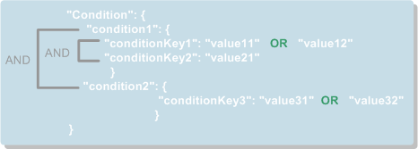

# 高级模式<a name="ZH-CN_TOPIC_0043394868"></a>

通过高级模式配置策略语言，可授权云服务或其他用户对主题进行多种操作，如查询主题详情、修改主题、发布消息及删除主题等。

## 什么是访问策略<a name="section14511343122012"></a>

访问策略是主题创建者针对主题设置的允许或拒绝其他用户或云服务对主题进行特定操作的一种策略。访问策略的组成如[表1](#table53240944112753)所示。

**表 1**  访问策略组成

<a name="table53240944112753"></a>
<table><thead align="left"><tr id="row21987414112753"><th class="cellrowborder" valign="top" width="15.1%" id="mcps1.2.4.1.1"><p id="p35443943112753"><a name="p35443943112753"></a><a name="p35443943112753"></a><strong id="b33764377112753"><a name="b33764377112753"></a><a name="b33764377112753"></a>名称</strong></p>
</th>
<th class="cellrowborder" valign="top" width="31.45%" id="mcps1.2.4.1.2"><p id="p1722161112753"><a name="p1722161112753"></a><a name="p1722161112753"></a><strong id="b52387134112753"><a name="b52387134112753"></a><a name="b52387134112753"></a>说明</strong></p>
</th>
<th class="cellrowborder" valign="top" width="53.449999999999996%" id="mcps1.2.4.1.3"><p id="p47496205112753"><a name="p47496205112753"></a><a name="p47496205112753"></a><strong id="b5277356112753"><a name="b5277356112753"></a><a name="b5277356112753"></a>约束</strong></p>
</th>
</tr>
</thead>
<tbody><tr id="row44101580112753"><td class="cellrowborder" valign="top" width="15.1%" headers="mcps1.2.4.1.1 "><p id="p36150079112753"><a name="p36150079112753"></a><a name="p36150079112753"></a>Version</p>
</td>
<td class="cellrowborder" valign="top" width="31.45%" headers="mcps1.2.4.1.2 "><p id="p42475248112753"><a name="p42475248112753"></a><a name="p42475248112753"></a>访问策略规范版本。</p>
</td>
<td class="cellrowborder" valign="top" width="53.449999999999996%" headers="mcps1.2.4.1.3 "><p id="p17943058112753"><a name="p17943058112753"></a><a name="p17943058112753"></a>目前只支持“2016-09-07”。</p>
</td>
</tr>
<tr id="row46405782112753"><td class="cellrowborder" valign="top" width="15.1%" headers="mcps1.2.4.1.1 "><p id="p61369906112753"><a name="p61369906112753"></a><a name="p61369906112753"></a>Id</p>
</td>
<td class="cellrowborder" valign="top" width="31.45%" headers="mcps1.2.4.1.2 "><p id="p4906500112753"><a name="p4906500112753"></a><a name="p4906500112753"></a>策略的唯一标识。</p>
</td>
<td class="cellrowborder" valign="top" width="53.449999999999996%" headers="mcps1.2.4.1.3 "><p id="p61882243112753"><a name="p61882243112753"></a><a name="p61882243112753"></a>不能为空。</p>
</td>
</tr>
<tr id="row39288912112753"><td class="cellrowborder" valign="top" width="15.1%" headers="mcps1.2.4.1.1 "><p id="p14998859112753"><a name="p14998859112753"></a><a name="p14998859112753"></a>Statement</p>
</td>
<td class="cellrowborder" valign="top" width="31.45%" headers="mcps1.2.4.1.2 "><p id="p1139155615212"><a name="p1139155615212"></a><a name="p1139155615212"></a>访问策略是通过Statement语句来定义的。一个访问策略可包含一条或多条Statement语句。通过Statement语句向其他用户或云服务授权对主题的操作。</p>
</td>
<td class="cellrowborder" valign="top" width="53.449999999999996%" headers="mcps1.2.4.1.3 "><p id="p31968219112753"><a name="p31968219112753"></a><a name="p31968219112753"></a>一个策略至少一条Statement语句。Statement语句的包含的元素，请参见<a href="#section19563388474">Statement语句的组成</a>。</p>
</td>
</tr>
</tbody>
</table>

如下所示的访问策略的示例，包含两个Statement语句：“Statement1”和“Statement2”。

```
{
    "Version": "2016-09-07",
    "Id": "access_policy_01",
    "Statement": [
       {Statement1},
       {Statement2}
    ]
}
```

## Statement语句的组成<a name="section19563388474"></a>

如下为修改主题访问策略的示例。Statement语句的组成如[表2](#table13574080155334)所示

```
{
    "Version": "2016-09-07", 
    "Id": "__default_policy_ID", 
    "Statement": [
           //第一个statement语句
        {
            "Sid": "__user_pub_0", 
            "Effect": "Allow", 
            "Principal": {
                "CSP": [
                    "urn:csp:iam::123456789:root",
                    "urn:csp:iam::987654321:root"
                ]
            }, 
            "Action": [
                "SMN:Publish", 
                "SMN:QueryTopicDetail"
            ], 
            "Resource": "urn:smn:regionId:e23bf08ebb924730b452426c60849564:ECM_BKS_Topic"
        }, 
        //第二个statement语句
       {
            "Sid": "__service_pub_0", 
            "Effect": "Allow", 
            "Principal": {
                "Service": [
                    "obs"
                ]
            }, 
            "Action": [
                "SMN:Publish", 
                "SMN:QueryTopicDetail"
            ], 
            "Resource": "urn:smn:regionId:e23bf08ebb924730b452426c60849564:ECM_BKS_Topic"
        }
    ]
}
```

**表 2**  Statement语句元素说明

<a name="table13574080155334"></a>
<table><thead align="left"><tr id="row2428006155334"><th class="cellrowborder" valign="top" width="17%" id="mcps1.2.4.1.1"><p id="p66371740155519"><a name="p66371740155519"></a><a name="p66371740155519"></a><strong id="b43082088194323"><a name="b43082088194323"></a><a name="b43082088194323"></a>元素名称</strong></p>
</th>
<th class="cellrowborder" valign="top" width="33%" id="mcps1.2.4.1.2"><p id="p66616597155519"><a name="p66616597155519"></a><a name="p66616597155519"></a><strong id="b62678468155519"><a name="b62678468155519"></a><a name="b62678468155519"></a>说明</strong></p>
</th>
<th class="cellrowborder" valign="top" width="50%" id="mcps1.2.4.1.3"><p id="p43791157155519"><a name="p43791157155519"></a><a name="p43791157155519"></a><strong id="b58576097155519"><a name="b58576097155519"></a><a name="b58576097155519"></a>约束</strong></p>
</th>
</tr>
</thead>
<tbody><tr id="row5501174215551"><td class="cellrowborder" valign="top" width="17%" headers="mcps1.2.4.1.1 "><p id="p2745813215551"><a name="p2745813215551"></a><a name="p2745813215551"></a>Sid</p>
</td>
<td class="cellrowborder" valign="top" width="33%" headers="mcps1.2.4.1.2 "><p id="p951625815551"><a name="p951625815551"></a><a name="p951625815551"></a>Statement语句的ID。</p>
</td>
<td class="cellrowborder" valign="top" width="50%" headers="mcps1.2.4.1.3 "><p id="p3261944415551"><a name="p3261944415551"></a><a name="p3261944415551"></a>Statement语句ID必须是唯一的，例如statement01、statement02。</p>
</td>
</tr>
<tr id="row2102549615551"><td class="cellrowborder" valign="top" width="17%" headers="mcps1.2.4.1.1 "><p id="p2303739015551"><a name="p2303739015551"></a><a name="p2303739015551"></a>Effect</p>
</td>
<td class="cellrowborder" valign="top" width="33%" headers="mcps1.2.4.1.2 "><p id="p5408933915551"><a name="p5408933915551"></a><a name="p5408933915551"></a>Statement语句的效果。</p>
</td>
<td class="cellrowborder" valign="top" width="50%" headers="mcps1.2.4.1.3 "><p id="p1916032815551"><a name="p1916032815551"></a><a name="p1916032815551"></a>“Allow”或者“Deny”。</p>
</td>
</tr>
<tr id="row233616615551"><td class="cellrowborder" valign="top" width="17%" headers="mcps1.2.4.1.1 "><p id="p923559515551"><a name="p923559515551"></a><a name="p923559515551"></a>Principal</p>
<p id="p143555201842"><a name="p143555201842"></a><a name="p143555201842"></a>NotPrincipal</p>
</td>
<td class="cellrowborder" valign="top" width="33%" headers="mcps1.2.4.1.2 "><a name="ul56995346416"></a><a name="ul56995346416"></a><ul id="ul56995346416"><li>Principal：Statement语句作用的对象。</li><li>NotPrincipal：Statement语句排除作用的对象。<p id="p716351816"><a name="p716351816"></a><a name="p716351816"></a>目前支持“CSP”和“Service”两类对象</p>
<a name="ul64637189213"></a><a name="ul64637189213"></a><ul id="ul64637189213"><li>“CSP”对象指的是其他用户，可以作用于多个用户。</li><li>“Service”对象指的是云服务，可以作用于多个云服务。</li></ul>
</li></ul>
</td>
<td class="cellrowborder" valign="top" width="50%" headers="mcps1.2.4.1.3 "><p id="p44931755164956"><a name="p44931755164956"></a><a name="p44931755164956"></a>Principal元素和NotPrincipal元素两者任选其一。</p>
<p id="p5690725519382"><a name="p5690725519382"></a><a name="p5690725519382"></a>选定后，“CSP”对象填写内容的格式为格式为urn:csp:iam::domainId:root，其中domainId为其他用户的“账号ID”，需要线下获取。</p>
<p id="p36629932194152"><a name="p36629932194152"></a><a name="p36629932194152"></a>“Service”对象填写内容的格式为小写的云服务名称缩写。</p>
</td>
</tr>
<tr id="row2239846215551"><td class="cellrowborder" valign="top" width="17%" headers="mcps1.2.4.1.1 "><p id="p5316167715551"><a name="p5316167715551"></a><a name="p5316167715551"></a>Action</p>
<p id="p586515126814"><a name="p586515126814"></a><a name="p586515126814"></a>NotAction</p>
</td>
<td class="cellrowborder" valign="top" width="33%" headers="mcps1.2.4.1.2 "><a name="ul139511146291"></a><a name="ul139511146291"></a><ul id="ul139511146291"><li>Action：Statement语句作用的操作。</li></ul>
<a name="ul16815171817"></a><a name="ul16815171817"></a><ul id="ul16815171817"><li>NotAction：Statement语句排除作用的操作。<p id="p328452812317"><a name="p328452812317"></a><a name="p328452812317"></a>允许使用通配符来表示一类操作，例如：SMN:Update*、SMN:Delete*。如果只填写“*”，表示Statement语句作用的操作为该资源支持的所有操作。</p>
</li></ul>
</td>
<td class="cellrowborder" valign="top" width="50%" headers="mcps1.2.4.1.3 "><p id="p58838218165112"><a name="p58838218165112"></a><a name="p58838218165112"></a>Action元素和NotAction元素两者任选其一</p>
<p id="p2900090715551"><a name="p2900090715551"></a><a name="p2900090715551"></a>目前支持的操作有：</p>
<a name="ul5968157515551"></a><a name="ul5968157515551"></a><ul id="ul5968157515551"><li>SMN:UpdateTopic</li><li>SMN:DeleteTopic</li><li>SMN:QueryTopicDetail</li><li>SMN:ListTopicAttributes</li><li>SMN:UpdateTopicAttribute</li><li>SMN:DeleteTopicAttributes</li><li>SMN:DeleteTopicAttributeByName</li><li>SMN:ListSubscriptionsByTopic</li><li>SMN:Subscribe</li><li>SMN:Unsubscribe</li><li>SMN:Publish</li></ul>
<p id="p722296915551"><a name="p722296915551"></a><a name="p722296915551"></a>授权操作与SMN接口的映射关系见附录<a href="授权操作与SMN接口的映射关系.md">授权操作与SMN接口的映射关系</a>。</p>
</td>
</tr>
<tr id="row3341670315551"><td class="cellrowborder" valign="top" width="17%" headers="mcps1.2.4.1.1 "><p id="p129519266014"><a name="p129519266014"></a><a name="p129519266014"></a>Resource</p>
<p id="p840677215551"><a name="p840677215551"></a><a name="p840677215551"></a>NotResource</p>
</td>
<td class="cellrowborder" valign="top" width="33%" headers="mcps1.2.4.1.2 "><a name="ul72911752161111"></a><a name="ul72911752161111"></a><ul id="ul72911752161111"><li>Resource：Statement语句作用的主题。</li><li>NotResource：Statement语句排除作用的主题。</li></ul>
</td>
<td class="cellrowborder" valign="top" width="50%" headers="mcps1.2.4.1.3 "><p id="p14977997165224"><a name="p14977997165224"></a><a name="p14977997165224"></a>Resource和NotResource两者任选其一</p>
<p id="p6045376015551"><a name="p6045376015551"></a><a name="p6045376015551"></a>选定后，填写内容为主题URN。</p>
</td>
</tr>
<tr id="row4349478515551"><td class="cellrowborder" valign="top" width="17%" headers="mcps1.2.4.1.1 "><p id="p5659329615551"><a name="p5659329615551"></a><a name="p5659329615551"></a>Condition</p>
</td>
<td class="cellrowborder" valign="top" width="33%" headers="mcps1.2.4.1.2 "><p id="p37454554173355"><a name="p37454554173355"></a><a name="p37454554173355"></a>Condition元素是Statement语句生效的条件。</p>
<p id="p26723033173357"><a name="p26723033173357"></a><a name="p26723033173357"></a>可选关键字。</p>
</td>
<td class="cellrowborder" valign="top" width="50%" headers="mcps1.2.4.1.3 "><p id="p176783435519"><a name="p176783435519"></a><a name="p176783435519"></a>支持的条件运算符和条件关键字</p>
<p id="p6238177815551"><a name="p6238177815551"></a><a name="p6238177815551"></a>详情请参考<a href="#section14635144017214">Condition元素的组成</a>。</p>
</td>
</tr>
</tbody>
</table>

## Condition元素的组成<a name="section14635144017214"></a>

Condition元素是Statement语句生效的条件，使用Condition元素可对主题做更细粒度的授权控制，Condition元素组成如[表3](#table101491067599)。

**表 3**  Condition元素组成

<a name="table101491067599"></a>
<table><thead align="left"><tr id="row114915625917"><th class="cellrowborder" valign="top" width="18.86%" id="mcps1.2.4.1.1"><p id="p91495655920"><a name="p91495655920"></a><a name="p91495655920"></a><strong id="b1614917615591"><a name="b1614917615591"></a><a name="b1614917615591"></a>名称</strong></p>
</th>
<th class="cellrowborder" valign="top" width="39.34%" id="mcps1.2.4.1.2"><p id="p41497665913"><a name="p41497665913"></a><a name="p41497665913"></a><strong id="b51651569599"><a name="b51651569599"></a><a name="b51651569599"></a>说明</strong></p>
</th>
<th class="cellrowborder" valign="top" width="41.8%" id="mcps1.2.4.1.3"><p id="p16165176155917"><a name="p16165176155917"></a><a name="p16165176155917"></a><strong id="b1516576115919"><a name="b1516576115919"></a><a name="b1516576115919"></a>约束</strong></p>
</th>
</tr>
</thead>
<tbody><tr id="row1116517695917"><td class="cellrowborder" valign="top" width="18.86%" headers="mcps1.2.4.1.1 "><p id="p61701541203038"><a name="p61701541203038"></a><a name="p61701541203038"></a>条件运算符</p>
</td>
<td class="cellrowborder" valign="top" width="39.34%" headers="mcps1.2.4.1.2 "><p id="p1181269593"><a name="p1181269593"></a><a name="p1181269593"></a>通过条件运算符匹配字符串、数字和日期时间。</p>
</td>
<td class="cellrowborder" valign="top" width="41.8%" headers="mcps1.2.4.1.3 "><p id="p1018113695913"><a name="p1018113695913"></a><a name="p1018113695913"></a>所有的时间均要符合iso-8601规范，条件运算符取值请参见<a href="#table5968190619132">表4</a>。</p>
</td>
</tr>
<tr id="row1418113615597"><td class="cellrowborder" valign="top" width="18.86%" headers="mcps1.2.4.1.1 "><p id="p61815605910"><a name="p61815605910"></a><a name="p61815605910"></a>条件关键字</p>
</td>
<td class="cellrowborder" valign="top" width="39.34%" headers="mcps1.2.4.1.2 "><p id="p8181126115919"><a name="p8181126115919"></a><a name="p8181126115919"></a>设置条件运算的对象。</p>
</td>
<td class="cellrowborder" valign="top" width="41.8%" headers="mcps1.2.4.1.3 "><p id="p121817612594"><a name="p121817612594"></a><a name="p121817612594"></a>不能为空。条件关键字取值请参见<a href="#table2955116119132">表5</a>。</p>
</td>
</tr>
</tbody>
</table>

满足所有条件运算符是使Statement语句的Effect判定为“Allow”的必要条件，若不满足则Statement语句的Effect判定为“Deny”。

如[图1](#fig47755643154052)所示，Condition元素包含2个“条件运算符”， “condition1”和“condition2”，采用逻辑AND来计算；

其中，“条件运算符condition1”包含2个“条件关键字”，“conditionKey1”和“conditionKey2”，采用逻辑AND来计算；

再者，“条件关键字conditionKey1”包含2个“条件对比值”，“value11”和“value12”，采用逻辑OR来计算。

**图 1**  条件控制逻辑<a name="fig47755643154052"></a>  


Condition元素示例如下。

```
"Condition": {
    "DateLessThan":{
         "csp:CurrentTime":"2016-11-07T15:35:00Z"
    },
    "StringLike": {
         "smn:Endpoint":["*@gmail.com","*@hotmail.com"]
    }
}
```

**表 4**  Condition元素条件运算符说明

<a name="table5968190619132"></a>
<table><thead align="left"><tr id="row4290733119132"><th class="cellrowborder" valign="top" width="13.16%" id="mcps1.2.4.1.1"><p id="p2506458319132"><a name="p2506458319132"></a><a name="p2506458319132"></a><strong id="b9871496104716"><a name="b9871496104716"></a><a name="b9871496104716"></a>类型</strong></p>
</th>
<th class="cellrowborder" valign="top" width="36.65%" id="mcps1.2.4.1.2"><p id="p1696531019132"><a name="p1696531019132"></a><a name="p1696531019132"></a><strong id="b61393674104716"><a name="b61393674104716"></a><a name="b61393674104716"></a>条件运算符</strong></p>
</th>
<th class="cellrowborder" valign="top" width="50.19%" id="mcps1.2.4.1.3"><p id="p3201289019132"><a name="p3201289019132"></a><a name="p3201289019132"></a><strong id="b6831713104716"><a name="b6831713104716"></a><a name="b6831713104716"></a>说明</strong></p>
</th>
</tr>
</thead>
<tbody><tr id="row314566219132"><td class="cellrowborder" rowspan="6" valign="top" width="13.16%" headers="mcps1.2.4.1.1 "><p id="p5294179219132"><a name="p5294179219132"></a><a name="p5294179219132"></a>String</p>
</td>
<td class="cellrowborder" valign="top" width="36.65%" headers="mcps1.2.4.1.2 "><p id="p4803328319132"><a name="p4803328319132"></a><a name="p4803328319132"></a>StringEquals</p>
</td>
<td class="cellrowborder" valign="top" width="50.19%" headers="mcps1.2.4.1.3 "><p id="p6549069019132"><a name="p6549069019132"></a><a name="p6549069019132"></a>字符串匹配，区分大小写</p>
</td>
</tr>
<tr id="row5796886519132"><td class="cellrowborder" valign="top" headers="mcps1.2.4.1.1 "><p id="p2831095819132"><a name="p2831095819132"></a><a name="p2831095819132"></a>StringNotEquals</p>
</td>
<td class="cellrowborder" valign="top" headers="mcps1.2.4.1.2 "><p id="p1148622319132"><a name="p1148622319132"></a><a name="p1148622319132"></a>字符串否定匹配，区分大小写</p>
</td>
</tr>
<tr id="row4881169119132"><td class="cellrowborder" valign="top" headers="mcps1.2.4.1.1 "><p id="p5195773919132"><a name="p5195773919132"></a><a name="p5195773919132"></a>StringEqualsIgnoreCase</p>
</td>
<td class="cellrowborder" valign="top" headers="mcps1.2.4.1.2 "><p id="p4782736919132"><a name="p4782736919132"></a><a name="p4782736919132"></a>字符串匹配，不区分大小写</p>
</td>
</tr>
<tr id="row2298817019132"><td class="cellrowborder" valign="top" headers="mcps1.2.4.1.1 "><p id="p3665204219132"><a name="p3665204219132"></a><a name="p3665204219132"></a>StringNotEqualsIgnoreCase</p>
</td>
<td class="cellrowborder" valign="top" headers="mcps1.2.4.1.2 "><p id="p1602538919132"><a name="p1602538919132"></a><a name="p1602538919132"></a>字符串否定匹配，不区分大小写</p>
</td>
</tr>
<tr id="row1747953819132"><td class="cellrowborder" valign="top" headers="mcps1.2.4.1.1 "><p id="p556694119132"><a name="p556694119132"></a><a name="p556694119132"></a>StringLike</p>
</td>
<td class="cellrowborder" valign="top" headers="mcps1.2.4.1.2 "><p id="p4826905719132"><a name="p4826905719132"></a><a name="p4826905719132"></a>字符串匹配，此值可包括一个或多个通配符 (*)</p>
</td>
</tr>
<tr id="row1491484719132"><td class="cellrowborder" valign="top" headers="mcps1.2.4.1.1 "><p id="p2309811419132"><a name="p2309811419132"></a><a name="p2309811419132"></a>StringNotLike</p>
</td>
<td class="cellrowborder" valign="top" headers="mcps1.2.4.1.2 "><p id="p5900795219132"><a name="p5900795219132"></a><a name="p5900795219132"></a>字符串的否定匹配，此值可包括一个或多个通配符 (*)</p>
</td>
</tr>
<tr id="row3951699519132"><td class="cellrowborder" rowspan="6" valign="top" width="13.16%" headers="mcps1.2.4.1.1 "><p id="p1590319132"><a name="p1590319132"></a><a name="p1590319132"></a>Numeric</p>
</td>
<td class="cellrowborder" valign="top" width="36.65%" headers="mcps1.2.4.1.2 "><p id="p2937190419132"><a name="p2937190419132"></a><a name="p2937190419132"></a>NumericEquals</p>
</td>
<td class="cellrowborder" valign="top" width="50.19%" headers="mcps1.2.4.1.3 "><p id="p3031402519132"><a name="p3031402519132"></a><a name="p3031402519132"></a>整数或小数值匹配</p>
</td>
</tr>
<tr id="row6388549019132"><td class="cellrowborder" valign="top" headers="mcps1.2.4.1.1 "><p id="p2010864219132"><a name="p2010864219132"></a><a name="p2010864219132"></a>NumericNotEquals</p>
</td>
<td class="cellrowborder" valign="top" headers="mcps1.2.4.1.2 "><p id="p1818730419132"><a name="p1818730419132"></a><a name="p1818730419132"></a>整数或小数值否定匹配</p>
</td>
</tr>
<tr id="row5085256419132"><td class="cellrowborder" valign="top" headers="mcps1.2.4.1.1 "><p id="p3809850019132"><a name="p3809850019132"></a><a name="p3809850019132"></a>NumericLessThan</p>
</td>
<td class="cellrowborder" valign="top" headers="mcps1.2.4.1.2 "><p id="p6607966419132"><a name="p6607966419132"></a><a name="p6607966419132"></a>整数或小数值“小于”匹配</p>
</td>
</tr>
<tr id="row698281619132"><td class="cellrowborder" valign="top" headers="mcps1.2.4.1.1 "><p id="p5501989919132"><a name="p5501989919132"></a><a name="p5501989919132"></a>NumericLessThanEquals</p>
</td>
<td class="cellrowborder" valign="top" headers="mcps1.2.4.1.2 "><p id="p2742685519132"><a name="p2742685519132"></a><a name="p2742685519132"></a>整数或小数值“小于或等于”匹配</p>
</td>
</tr>
<tr id="row1147489819132"><td class="cellrowborder" valign="top" headers="mcps1.2.4.1.1 "><p id="p6284534919132"><a name="p6284534919132"></a><a name="p6284534919132"></a>NumericGreaterThan</p>
</td>
<td class="cellrowborder" valign="top" headers="mcps1.2.4.1.2 "><p id="p5730847519132"><a name="p5730847519132"></a><a name="p5730847519132"></a>整数或小数值“大于”匹配</p>
</td>
</tr>
<tr id="row5018423919132"><td class="cellrowborder" valign="top" headers="mcps1.2.4.1.1 "><p id="p3616522119132"><a name="p3616522119132"></a><a name="p3616522119132"></a>NumericGreaterThanEquals</p>
</td>
<td class="cellrowborder" valign="top" headers="mcps1.2.4.1.2 "><p id="p4370179219132"><a name="p4370179219132"></a><a name="p4370179219132"></a>整数或小数值“大于或等于”匹配</p>
</td>
</tr>
<tr id="row3189125619132"><td class="cellrowborder" rowspan="6" valign="top" width="13.16%" headers="mcps1.2.4.1.1 "><p id="p4900497019132"><a name="p4900497019132"></a><a name="p4900497019132"></a>Date</p>
</td>
<td class="cellrowborder" valign="top" width="36.65%" headers="mcps1.2.4.1.2 "><p id="p264380019132"><a name="p264380019132"></a><a name="p264380019132"></a>DateEquals</p>
</td>
<td class="cellrowborder" valign="top" width="50.19%" headers="mcps1.2.4.1.3 "><p id="p1282128619132"><a name="p1282128619132"></a><a name="p1282128619132"></a>特定日期匹配</p>
</td>
</tr>
<tr id="row498908719132"><td class="cellrowborder" valign="top" headers="mcps1.2.4.1.1 "><p id="p1858585519132"><a name="p1858585519132"></a><a name="p1858585519132"></a>DateNotEquals</p>
</td>
<td class="cellrowborder" valign="top" headers="mcps1.2.4.1.2 "><p id="p2905925019132"><a name="p2905925019132"></a><a name="p2905925019132"></a>特定日期否定匹配</p>
</td>
</tr>
<tr id="row5981550319132"><td class="cellrowborder" valign="top" headers="mcps1.2.4.1.1 "><p id="p4490178619132"><a name="p4490178619132"></a><a name="p4490178619132"></a>DateLessThan</p>
</td>
<td class="cellrowborder" valign="top" headers="mcps1.2.4.1.2 "><p id="p1316603019132"><a name="p1316603019132"></a><a name="p1316603019132"></a>在特定日期和时间之前匹配</p>
</td>
</tr>
<tr id="row3901926819132"><td class="cellrowborder" valign="top" headers="mcps1.2.4.1.1 "><p id="p146861519132"><a name="p146861519132"></a><a name="p146861519132"></a>DateLessThanEquals</p>
</td>
<td class="cellrowborder" valign="top" headers="mcps1.2.4.1.2 "><p id="p5184899719132"><a name="p5184899719132"></a><a name="p5184899719132"></a>在特定日期和时间，或之前匹配</p>
</td>
</tr>
<tr id="row18112519132"><td class="cellrowborder" valign="top" headers="mcps1.2.4.1.1 "><p id="p1562910019132"><a name="p1562910019132"></a><a name="p1562910019132"></a>DateGreaterThan</p>
</td>
<td class="cellrowborder" valign="top" headers="mcps1.2.4.1.2 "><p id="p5799755019132"><a name="p5799755019132"></a><a name="p5799755019132"></a>在特定日期和时间之后匹配</p>
</td>
</tr>
<tr id="row2499068619132"><td class="cellrowborder" valign="top" headers="mcps1.2.4.1.1 "><p id="p163013219132"><a name="p163013219132"></a><a name="p163013219132"></a>DateGreaterThanEquals</p>
</td>
<td class="cellrowborder" valign="top" headers="mcps1.2.4.1.2 "><p id="p6493187719132"><a name="p6493187719132"></a><a name="p6493187719132"></a>在特定日期和时间，或之后匹配</p>
</td>
</tr>
<tr id="row3414260819132"><td class="cellrowborder" valign="top" width="13.16%" headers="mcps1.2.4.1.1 "><p id="p4367769419132"><a name="p4367769419132"></a><a name="p4367769419132"></a>Bool</p>
</td>
<td class="cellrowborder" valign="top" width="36.65%" headers="mcps1.2.4.1.2 "><p id="p4823234819132"><a name="p4823234819132"></a><a name="p4823234819132"></a>Bool</p>
</td>
<td class="cellrowborder" valign="top" width="50.19%" headers="mcps1.2.4.1.3 "><p id="p1450609019132"><a name="p1450609019132"></a><a name="p1450609019132"></a>布尔值匹配</p>
</td>
</tr>
</tbody>
</table>

**表 5**  Condition元素条件关键字

<a name="table2955116119132"></a>
<table><thead align="left"><tr id="row5949074419132"><th class="cellrowborder" valign="top" width="39.1%" id="mcps1.2.3.1.1"><p id="p5987618819132"><a name="p5987618819132"></a><a name="p5987618819132"></a><strong id="b1998748014354"><a name="b1998748014354"></a><a name="b1998748014354"></a>条件关键字</strong></p>
</th>
<th class="cellrowborder" valign="top" width="60.9%" id="mcps1.2.3.1.2"><p id="p1813304819132"><a name="p1813304819132"></a><a name="p1813304819132"></a><strong id="b837318214354"><a name="b837318214354"></a><a name="b837318214354"></a>说明</strong></p>
</th>
</tr>
</thead>
<tbody><tr id="row2942941119132"><td class="cellrowborder" valign="top" width="39.1%" headers="mcps1.2.3.1.1 "><p id="p5402093219132"><a name="p5402093219132"></a><a name="p5402093219132"></a>csp:CurrentTime</p>
</td>
<td class="cellrowborder" valign="top" width="60.9%" headers="mcps1.2.3.1.2 "><p id="p1361939719132"><a name="p1361939719132"></a><a name="p1361939719132"></a>当前时间</p>
</td>
</tr>
<tr id="row6040274319132"><td class="cellrowborder" valign="top" width="39.1%" headers="mcps1.2.3.1.1 "><p id="p6353811219132"><a name="p6353811219132"></a><a name="p6353811219132"></a>smn:Protocol</p>
</td>
<td class="cellrowborder" valign="top" width="60.9%" headers="mcps1.2.3.1.2 "><p id="p4631346019132"><a name="p4631346019132"></a><a name="p4631346019132"></a>订阅的协议，该关键字只在SMN:Subscribe操作时有效。</p>
</td>
</tr>
<tr id="row1972393119132"><td class="cellrowborder" valign="top" width="39.1%" headers="mcps1.2.3.1.1 "><p id="p675378319132"><a name="p675378319132"></a><a name="p675378319132"></a>smn:Endpoint</p>
</td>
<td class="cellrowborder" valign="top" width="60.9%" headers="mcps1.2.3.1.2 "><p id="p1018555919132"><a name="p1018555919132"></a><a name="p1018555919132"></a>订阅的终端，该关键字只在SMN:Subscribe操作时有效。</p>
</td>
</tr>
</tbody>
</table>

